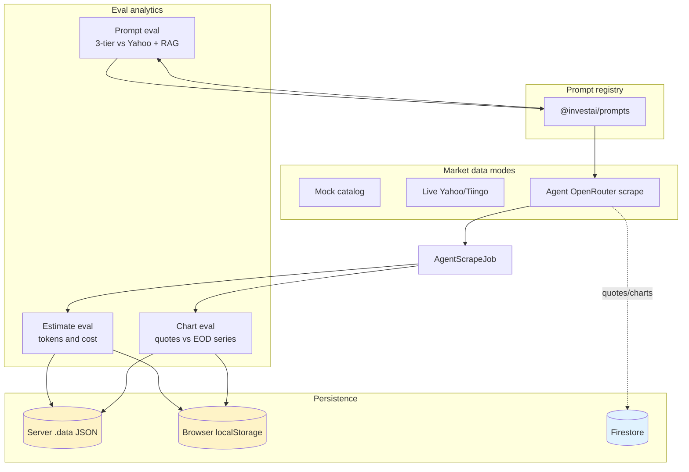
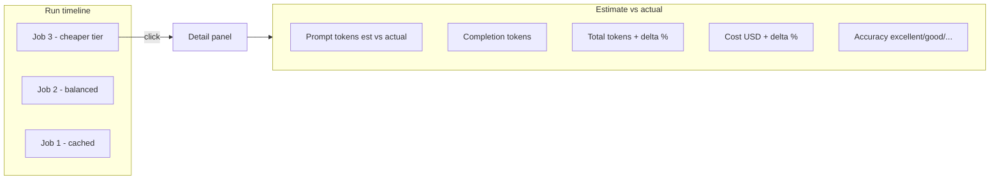
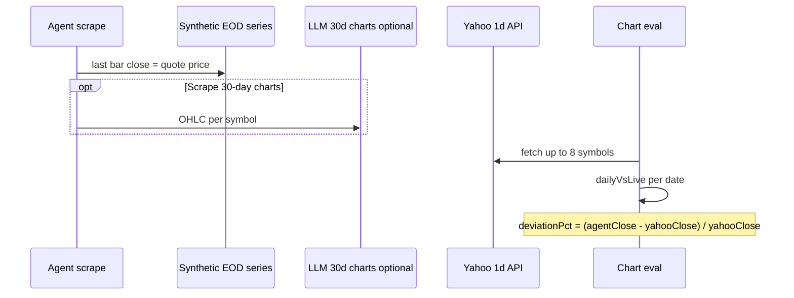

# InvestAI Financial App (Product Demo)

A modern financial dashboard application built with React, TypeScript, and Vite. Track stocks in real-time, manage your portfolio, get AI-powered insights, and stay updated with the latest financial news.

## vercel demo
https://financial-investment-with-gemini-in.vercel.app/


## Prototype & Presentation
https://water-matrix-96907145.figma.site

## ✨ Features

### 📊 Real-Time Stock Data
- Track 78+ stocks across 20+ sectors in real-time
- Live price updates from Yahoo Finance API
- Interactive charts with price history and volume data
- Search functionality to find stocks quickly
- Filter by sector: Technology, Healthcare, Finance, Energy, and more

### 💼 Portfolio Management
- Add, edit, and delete stock holdings
- Real-time portfolio value calculation
- Track total shares and individual stock performance
- Persistent storage with Firebase Firestore
- Watchlist functionality with price alerts

### 🤖 AI-Powered Insights
- Market sentiment analysis powered by OpenRouter AI (Llama + Qwen)
- Personalized stock recommendations
- Portfolio diversification analysis
- Risk assessment and growth predictions
- Dynamic market trend analysis

### 📰 Financial News
- Curated financial news in blog-style layout
- Full article view with modal dialogs
- Beautiful imagery from Unsplash
- Stay updated with market-moving news

### 📐 Agent scrape evals (Estimate, Chart & Prompt)
- **Estimate eval** — compares pre-scrape token/cost **estimates** to **actual** OpenRouter usage per job
- **Chart eval** — compares agent **quotes** to chart **EOD closes** and optional **Yahoo** daily bars (metrics only — does not change prompts)
- **Prompt eval** — runs **three LLM tiers** vs **Yahoo golden** with optional **RAG**; timeline tracks **versioned** prompts (`@investai/prompts`)
- **Prompt registry** — dated templates for quote/chart/news/insights/prediction; `GET /api/agent-scrape/prompts`
- Clickable **run timelines** in the UI; detail panels show deviation charts, golden tables, and RAG flow on one screen
- Study guide: [docs/PROMPT_ENGINEERING.md](./docs/PROMPT_ENGINEERING.md) · scope: [docs/PROJECT_SCOPE.md](./docs/PROJECT_SCOPE.md) · evals: [docs/AGENT_EVALS.md](./docs/AGENT_EVALS.md)

## 🚀 Quick Start

### Prerequisites

- Node.js 18+ and npm
- OpenRouter API key ([Get it here](https://openrouter.ai/keys))
- Firebase project ([Create one here](https://console.firebase.google.com/)) — optional

### Installation

1. **Clone the repository**
   ```bash
   git clone <your-repo-url>
   cd financial-investment-with-gemini-insights
   ```

2. **Install dependencies**
   ```bash
   npm install
   ```

3. **Set up environment variables**
   
   Copy `.env.example` to `.env` at the repo root (server-side secrets only):
   ```env
   OPENROUTER_API_KEY=sk-or-v1-your_key_here
   OPENROUTER_MODEL_PRIMARY=deepseek/deepseek-chat-v3-0324
   OPENROUTER_MODEL_FALLBACK=qwen/qwen3.5-flash-02-23
   FIREBASE_API_KEY=...
   FIREBASE_PROJECT_ID=...
   FIREBASE_APP_INSTANCE_ID=financial-app
   ```

4. **Enable Firestore Database**
   
   Follow [FIREBASE_SETUP.md](./FIREBASE_SETUP.md).

5. **Start backend + frontend**
   ```bash
   npm run dev
   ```
   - API: `http://localhost:3001/api/health`
   - UI: `http://localhost:5173`

6. **Run tests**
   ```bash
   npm test
   ```

## Documentation

- [AGENTS.md](./AGENTS.md) — **fast orientation for humans & coding agents**
- [Prompt engineering](./docs/PROMPT_ENGINEERING.md) — **versioned prompts, RAG, eval iteration**; chart batching case study (per-symbol vs bulk)
- [Project scope](./docs/PROJECT_SCOPE.md) — golden eval, 3-tier LLM comparison, RAG, prompt iteration
- [Agent scrape evals](./docs/AGENT_EVALS.md) — **estimate, chart & prompt eval dashboards** (full detail + diagrams)
- [Dev log 2026-05-19](./docs/DEV_LOG_2026-05-19.md) — prompt registry + chart RAG on jobs
- [How it works now](./docs/HOW_IT_WORKS_NOW.md) — market modes, Tiingo/Yahoo, caching
- [Cache architecture](./docs/CACHE.md) — memory, Firestore, eval disk storage
- [Codebase map](./docs/CODEBASE_MAP.md) — file-by-file index
- [Architecture guide](./docs/ARCHITECTURE.md) — system design + MVC
- [Feature modules](./docs/FEATURE_MODULES.md) — how to add/split modules
- [Agent scrape mode](./docs/AGENT_SCRAPE.md) — OpenRouter quote/news/chart jobs

## Agent scrape evals (overview)

In **Agent** market mode you get scrape jobs plus three eval surfaces. Open **Estimate eval**, **Chart eval**, and **Prompt eval** from the header. Prompt templates live in `packages/prompts` — see [docs/PROMPT_ENGINEERING.md](./docs/PROMPT_ENGINEERING.md).

### System context



**Important:** Firestore holds **portfolio**, **AI insights**, and **market/agent quote bulk** caches. Eval **history logs** use disk + localStorage so analytics survive without mixing into quote cache documents.

### Estimate eval — what you see when you click a run



1. Before scrape: `estimateSnapshot` from `estimateAgentScrape()`.  
2. After scrape: actual `usage` on the job.  
3. Dashboard computes delta % and rating (`excellent` ≤10%, etc.).

### Chart eval — EOD alignment and Yahoo comparison

Yahoo charts use `interval: 1d`: each point is the **session close** (end of day), not the open. Agent synthetic series uses the same **trading-day / EOD** convention (`buildEodSeriesFromQuote` in `packages/shared`).



**UI after click:** symbol table, **Agent vs Yahoo** line chart (EOD closes by day), **daily deviation %** bar chart.

### Skip cache (fresh data for eval)

| User action | Result |
|-------------|--------|
| Agent job with **Force live** | Clears agent caches → full scrape → new eval rows |
| **Refresh** on stocks (`?refresh=1`) | Clears market + agent caches |
| **Load from cache** | 0 tokens; estimate rating = `cached` |

Full diagrams, API paths, and file index: **[docs/AGENT_EVALS.md](./docs/AGENT_EVALS.md)**

---

## 🏗️ Project Structure (Modular Monolith)

```
├── apps/
│   ├── frontend/          # React + Vite UI
│   │   ├── api/           # HTTP client
│   │   ├── components/
│   │   └── contexts/
│   └── backend/           # Express API (MVC)
│       └── src/
│           ├── modules/   # market | ai | portfolio | agent-scrape | health
│           │   ├── controllers/
│           │   ├── services/
│           │   └── routes/
│           └── utils/
├── packages/
│   └── shared/            # Shared TypeScript types
├── styles/                # (legacy path if present)
├── .env                 # Environment variables (not committed)
├── .env.example         # Example environment variables
└── App.tsx              # Main application component
```

## 🛠️ Tech Stack

- **Frontend Framework**: React 18.3.1 + TypeScript
- **Build Tool**: Vite 6.4.1
- **Styling**: Tailwind CSS 3.4
- **UI Components**: shadcn/ui + Radix UI
- **Charts**: Recharts
- **Icons**: Lucide React
- **Stock Data**: Yahoo Finance API (via CORS proxy)
- **AI Insights**: OpenRouter (Llama 3.3 70B free → Qwen3 8B free fallback)
- **Database**: Firebase Firestore
- **Deployment**: Vercel-ready

## 📦 Available Scripts

```bash
# Start development server
npm run dev

# Build for production
npm run build

# Preview production build
npm run preview

# Run linter
npm run lint
```

## 🔑 API Keys & Configuration

### OpenRouter API
- Primary model: `deepseek/deepseek-chat-v3-0324` (DeepSeek V3)
- Fallback: `qwen/qwen3.5-flash-02-23` (Qwen 3.5 Flash)
- Get your API key: https://openrouter.ai/keys
- Add to root `.env` as `OPENROUTER_API_KEY`

### Firebase Firestore
- Free tier: 50K reads, 20K writes per day
- Create project: https://console.firebase.google.com/
- See [FIREBASE_SETUP.md](./FIREBASE_SETUP.md) for detailed setup

### Yahoo Finance API
- Used via free CORS proxy (corsproxy.io)
- No API key required
- Fetches real-time stock data for 78+ stocks

## 🌐 Deployment

### Deploy to Vercel

1. **Push to GitHub**
   ```bash
   git init
   git add .
   git commit -m "Initial commit"
   git branch -M main
   git remote add origin <your-repo-url>
   git push -u origin main
   ```

2. **Import to Vercel**
   - Go to [vercel.com](https://vercel.com)
   - Click "New Project"
   - Import your GitHub repository

3. **Add Environment Variables**
   
   In Vercel project settings, add all variables from your `.env` file:
   - `OPENROUTER_API_KEY`
   - `VITE_FIREBASE_API_KEY`
   - `VITE_FIREBASE_AUTH_DOMAIN`
   - `VITE_FIREBASE_PROJECT_ID`
   - `VITE_FIREBASE_STORAGE_BUCKET`
   - `VITE_FIREBASE_MESSAGING_SENDER_ID`
   - `VITE_FIREBASE_APP_ID`
   - `VITE_FIREBASE_APP_INSTANCE_ID`

4. **Deploy**
   
   Vercel will automatically build and deploy your app!

## 📊 Supported Stocks

The app tracks 78+ stocks across 20+ sectors including:

- **Technology**: Apple (AAPL), Microsoft (MSFT), Google (GOOGL), NVIDIA (NVDA)
- **Finance**: JPMorgan (JPM), Bank of America (BAC), Goldman Sachs (GS)
- **Healthcare**: Johnson & Johnson (JNJ), Pfizer (PFE), UnitedHealth (UNH)
- **Consumer**: Amazon (AMZN), Tesla (TSLA), Nike (NKE), Starbucks (SBUX)
- **Energy**: ExxonMobil (XOM), Chevron (CVX), ConocoPhillips (COP)
- And many more...

## 🔒 Security

- ✅ All API keys stored in `.env` (not committed to Git)
- ✅ Firebase security rules for authenticated users
- ✅ Environment variables used throughout the app
- ✅ `.gitignore` configured to exclude sensitive files
- ✅ Separate Firestore collections per app instance

## 🤝 Contributing

Contributions are welcome! Please feel free to submit a Pull Request.

1. Fork the repository
2. Create your feature branch (`git checkout -b feature/AmazingFeature`)
3. Commit your changes (`git commit -m 'Add some AmazingFeature'`)
4. Push to the branch (`git push origin feature/AmazingFeature`)
5. Open a Pull Request

## 📝 License

This project is licensed under the MIT License.

## 🙏 Acknowledgments

- [Yahoo Finance](https://finance.yahoo.com/) for stock data
- [OpenRouter](https://openrouter.ai/) for AI insights
- [Firebase](https://firebase.google.com/) for database
- [shadcn/ui](https://ui.shadcn.com/) for beautiful UI components
- [Recharts](https://recharts.org/) for data visualization
- [Unsplash](https://unsplash.com/) for stock imagery

## 📧 Support

For questions or support, please open an issue on GitHub.

---

Built with ❤️ using React + TypeScript + Vite

## Features in Detail

### Dashboard
- Portfolio value tracking
- Market status indicator
- Stock cards with key metrics
- 30-day price charts
- Refresh functionality

### Stock Comparison
- Sortable comparison table
- Search by symbol or name
- Filter by performance (gainers/losers)
- Summary statistics

### News Feed
- Latest market news
- Sentiment indicators
- Category filtering
- Related stock tags

### AI Insights
- Buy/Hold/Sell recommendations with confidence scores
- Market trend analysis
- Risk alerts with recommendations
- Powered by OpenRouter (configurable models)

### Agent eval dashboards
- **Estimate eval:** timeline of scrapes → click to see estimated vs actual tokens and USD
- **Chart eval:** timeline of scrapes → click to see quote/chart alignment and agent vs Yahoo EOD deviation charts
- See [docs/AGENT_EVALS.md](./docs/AGENT_EVALS.md)

### Portfolio
- Holdings with performance tracking
- Watchlist management
- Custom price alerts
- Best/worst performer tracking

## Development Tips

- The app uses mock data as fallback when APIs are unavailable
- API responses are cached for 1 minute to reduce API calls
- All components use shadcn/ui for consistent styling
- TypeScript provides full type safety

## License

MIT

## Contributing

Feel free to submit issues and enhancement requests!
