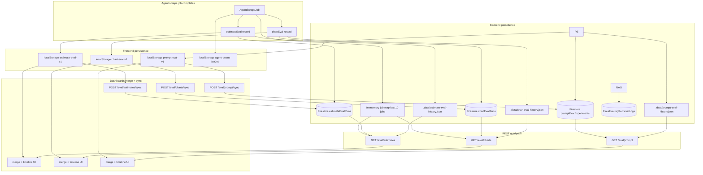
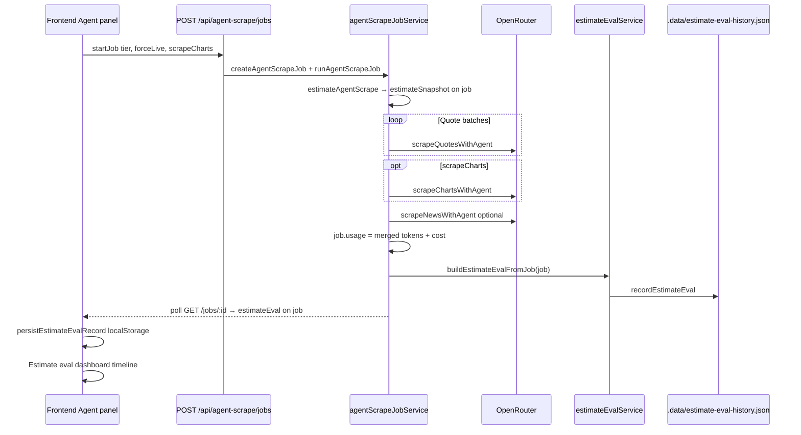
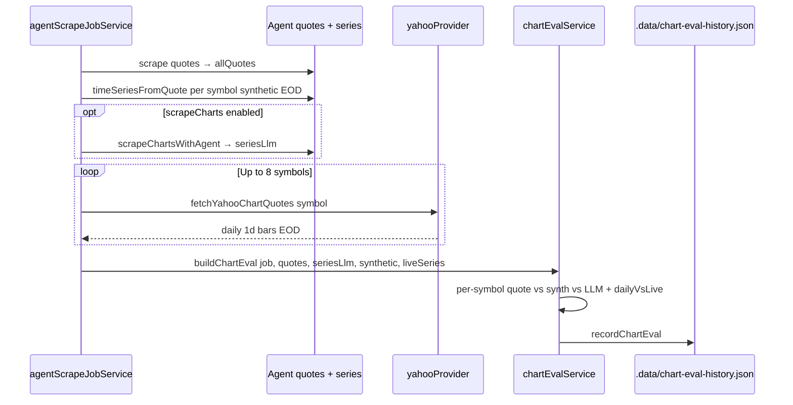
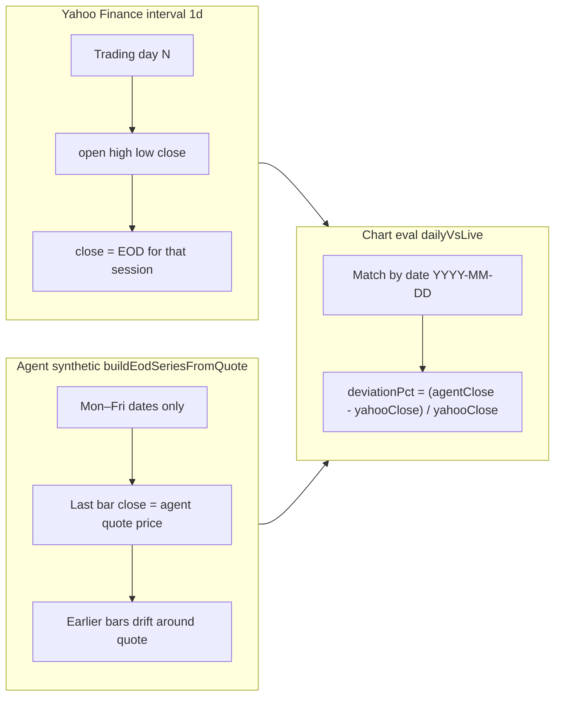
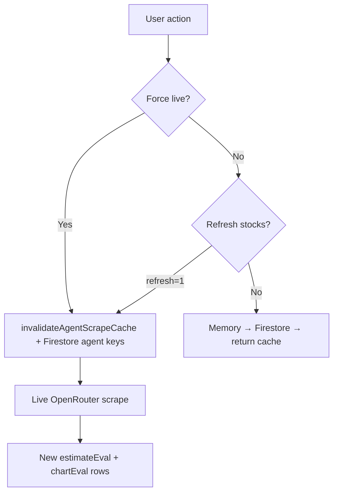
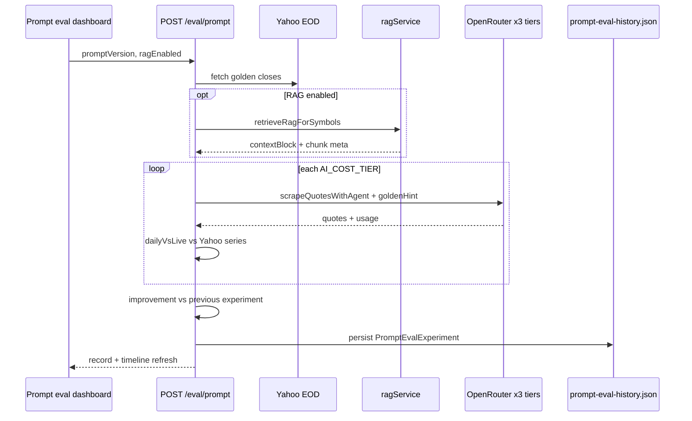

# Agent scrape evals

InvestAI records **eval analytics** for agent-scraped data: automatic logs after each scrape job, plus on-demand **prompt experiments** (three LLM tiers vs Yahoo golden). These are **not** market quote caches.

**UI entry points:** App header → **Estimate eval** | **Chart eval** | **Prompt eval**

**Product scope:** [PROJECT_SCOPE.md](./PROJECT_SCOPE.md) — golden dataset, RAG, tier comparison, improvement timeline.

---

## What gets measured

| Dashboard | Question it answers | Golden reference |
|-----------|---------------------|------------------|
| **Estimate eval** | Did our **pre-scrape token/cost estimate** match **actual OpenRouter usage**? | Actual `usage` on the completed job |
| **Chart eval** | Do **agent quotes** align with **chart last closes** and with **Yahoo EOD** bars? | Synthetic/LLM series + optional Yahoo `1d` chart |
| **Prompt eval** | Do **three cost tiers** match **Yahoo EOD** with a given **prompt version** and optional **RAG**? | Yahoo fetched at experiment time + improvement vs previous run |

---

## Where data is stored (triple layer)

Eval logs use **browser localStorage + server disk + Firestore** (when Firebase is configured). Market quote caches remain separate (`marketBulkCache`, `agentBulkCache`, etc.).

| Store | Path / key | Survives Railway restart? |
|-------|------------|---------------------------|
| Estimate eval (server) | `apps/backend/.data/estimate-eval-history.json` | Yes (if disk persists) |
| Chart eval (server) | `apps/backend/.data/chart-eval-history.json` | Yes |
| Estimate eval (browser) | `investai-estimate-eval-v1` | Per browser only |
| Chart eval (browser) | `investai-chart-eval-v1` | Per browser only |
| Prompt eval (server) | `apps/backend/.data/prompt-eval-history.json` | Yes (if disk persists) |
| Prompt eval (browser) | `investai-prompt-eval-v1` | Per browser only |
| Completed job snapshot | `investai-agent-queue-v1` → `lastJob` | Per browser only |

**Firestore** is used for portfolio, AI insights cache, and **market/agent quote bulk** — not for eval history.

---

## Estimate eval — end-to-end flow

### Pre-run snapshot

Before quote batches run, the job stores `estimateSnapshot` from `estimateAgentScrape()`:

- Estimated prompt / completion / total tokens  
- Estimated USD cost for the selected tier  
- Whether quotes/news were expected to hit cache  

If estimation fails, the job still completes but **no estimate eval row** is produced (`buildEstimateEvalFromJob` returns `null` without snapshot).

### Accuracy ratings

| Rating | Rule |
|--------|------|
| `cached` | Actual tokens = 0 (fully cached load) |
| `excellent` | \|token delta %\| ≤ 10% |
| `good` | ≤ 25% |
| `fair` | ≤ 50% |
| `poor` | > 50% |
| `unknown` | Estimate total was 0 |

### UI: clickable timeline

1. Left: **Run timeline** — one row per `jobId` (newest first).  
2. Click a row → right panel shows **Estimate vs actual** table:  
   - Prompt / completion / total tokens (estimated, actual, delta, Δ%)  
   - Cost USD (same columns)

Shared types: `packages/shared/src/estimateEval.ts`  
Backend: `apps/backend/src/modules/agent-scrape/services/estimateEvalService.ts`  
Frontend: `apps/frontend/modules/market/views/EstimateEvalDashboard.tsx`

---

## Chart eval — end-to-end flow

### EOD price convention (Yahoo vs agent)

Both live (Yahoo) and agent synthetic series use **daily end-of-session close**, not open.

| Topic | Behavior |
|-------|----------|
| **Today's bar** | Yahoo’s latest `1d` bar is the **most recent trading session** (may update while US market is open). Agent last bar uses the **scraped quote** as that session’s close. |
| **Weekends** | Agent synthetic skips Sat/Sun; Yahoo returns trading days only. |
| **30-day vs 1-day** | Dashboard charts slice the same EOD series (3d / 7d / 30d). Eval reports **latest-session** deviation and **avg \|deviation\| per day** over ~30 trading days. |
| **LLM charts** | When “Scrape 30-day charts” is enabled, LLM OHLC is compared the same way; `dailyVsLive` uses LLM series when present. |

### Per-run metrics (symbol table)

| Column | Meaning |
|--------|---------|
| Quote | Agent-scraped “current” price |
| Synthetic last close | Last point of EOD synthetic series |
| Quote vs synth % | Alignment of quote to synthetic chart |
| LLM last close | Last point of LLM-scraped series (if enabled) |
| Avg \|agent − Yahoo\| / day | Mean absolute daily % vs Yahoo (up to 8 symbols) |

### UI: clickable timeline + charts

1. Left: **Run timeline** (mode, symbol count, avg deltas).  
2. Click → detail panel:  
   - Summary metrics table  
   - Symbol selector  
   - **Line chart:** Agent EOD vs Yahoo EOD by date  
   - **Bar chart:** Daily deviation % (agent − Yahoo)  

Runs **before** Yahoo reference was added show tables only (no day charts).

Shared types: `packages/shared/src/chartEval.ts`, `packages/shared/src/tradingDays.ts`  
Backend: `apps/backend/src/modules/agent-scrape/services/chartEvalService.ts`  
Frontend: `apps/frontend/modules/market/views/ChartEvalDashboard.tsx`

---

## API reference

| Method | Path | Response shape |
|--------|------|----------------|
| `GET` | `/api/agent-scrape/eval/estimates` | `{ records[], summary }` |
| `GET` | `/api/agent-scrape/eval/charts` | `{ records[], lastRecord }` |

Both merge **disk history** with **recent in-memory jobs** (same pattern).

---

## Skip cache / force fresh scrape

Eval quality depends on running a real scrape. Cache bypass options:

| Action | Effect on eval |
|--------|----------------|
| Agent job **Force live** (`forceLive: true`) | Clears agent memory + agent Firestore caches; full scrape; new eval rows |
| Market **Refresh** (`?refresh=1`) | Clears market + agent caches; next load may create new bulk data |
| **Load from cache** | 0 tokens; estimate eval rating = `cached` |

---

## Code map

| Piece | Location |
|-------|----------|
| Build estimate eval from job | `packages/shared/src/estimateEval.ts` → `buildEstimateEvalFromJob` |
| Persist / load estimate history | `estimateEvalService.ts` |
| Build chart eval + daily vs live | `chartEvalService.ts` |
| EOD trading-day helpers | `packages/shared/src/tradingDays.ts` |
| Job orchestration | `agentScrapeJobService.ts` |
| Timeline UI component | `apps/frontend/modules/market/views/eval/EvalRunTimeline.tsx` |
| Estimate detail panel | `views/eval/EstimateEvalRunDetail.tsx` |
| Chart detail panel | `views/eval/ChartEvalRunDetail.tsx` |
| Prompt eval service | `promptEvalService.ts`, `ragService.ts` |
| Prompt eval UI | `PromptEvalDashboard.tsx`, `PromptEvalRunDetail.tsx`, `RagFlowPanel.tsx` |
| Tests | `chartEvalService.test.ts`, `evalHistoryApi.test.ts` |

---

## Prompt eval — end-to-end flow

**UI:** Timeline lists prompt versions with RAG badge and deviation delta. Selecting a run opens golden vs three tiers, tier bar charts, EOD line chart, and **RAG flow** panel on one screen.

**Prompt registry:** `promptVersion` in the UI (e.g. `v-2026-05-19`) resolves to a template in `packages/prompts` (`quote-scrape` `2026-05-19`). Experiments store `promptSuite` with the resolved version. Catalog: `GET /api/agent-scrape/prompts`. See [PROMPT_ENGINEERING.md](./PROMPT_ENGINEERING.md).

**Chart / estimate eval:** These dashboards measure job outcomes; they do **not** version or edit prompts. To improve charts, bump `chart-scrape` in `@investai/prompts` and re-run Agent **Start**.

---

## Related docs

- [Prompt engineering](./PROMPT_ENGINEERING.md) — versioned templates, RAG, iteration workflow  
- [Project scope](./PROJECT_SCOPE.md) — goals, golden dataset, RAG, tiers  
- [Agent scrape mode](./AGENT_SCRAPE.md) — quotes, news, jobs  
- [Cache architecture](./CACHE.md) — market vs eval storage  
- [How it works now](./HOW_IT_WORKS_NOW.md) — live/mock/agent market modes  
