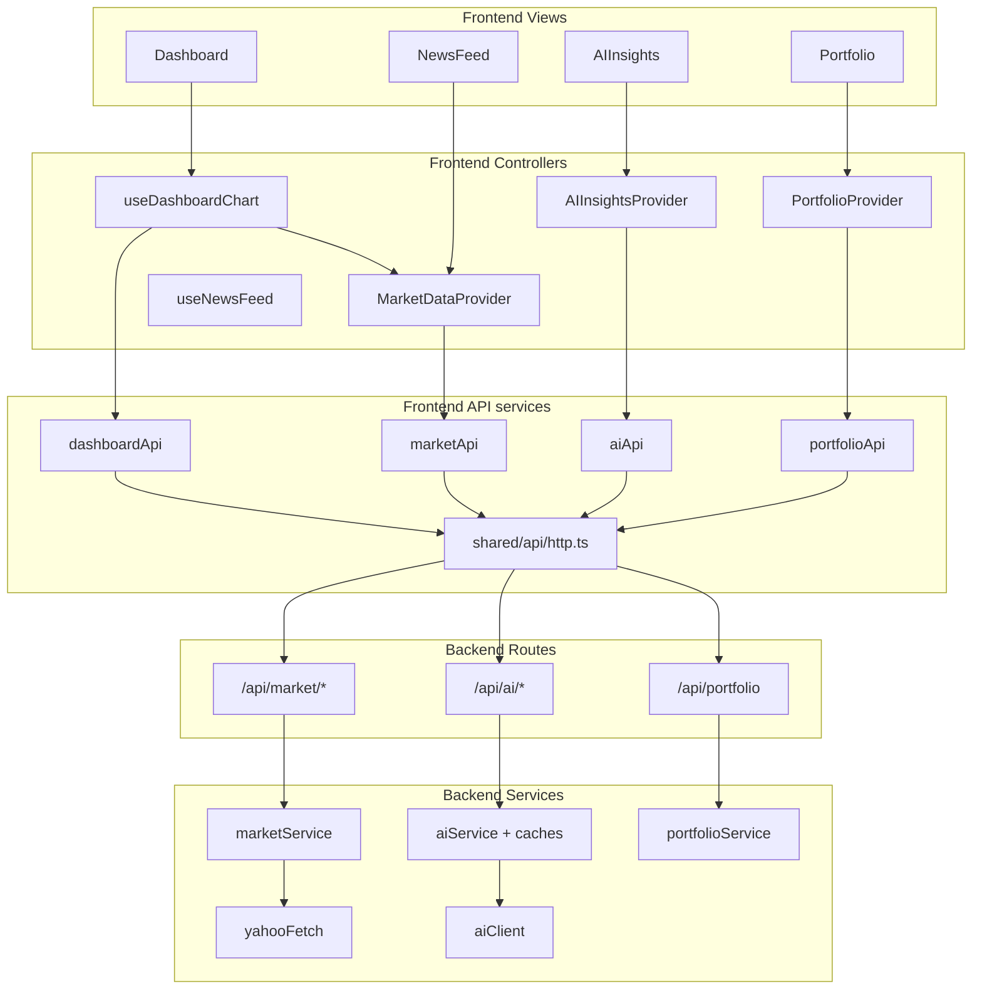

# API layers — how calls are organized

Quick reference for humans and coding agents.

## Layer diagram



## Rule: one `fetch` entry point per app

| App | Only here |
|-----|-----------|
| Frontend | `shared/api/http.ts` |
| Backend (HTTP out) | `utils/yahooFetch.ts`, `utils/aiClient.ts` |
| Backend (HTTP in) | `modules/*/routes` → `controllers` → `services` |

Views and controllers must **not** call `fetch` directly.

---

## Frontend API services (by feature)

| Service file | Endpoints | Used by |
|--------------|-----------|---------|
| `modules/market/services/marketApi.ts` | `GET /api/market/stocks`, `GET /api/market/news` | `MarketDataProvider` |
| `modules/dashboard/services/dashboardApi.ts` | `GET .../timeseries`, `POST .../prediction` | `useDashboardChart` |
| `modules/ai-insights/services/aiApi.ts` | `GET /api/ai/insights` | `AIInsightsProvider` |
| `modules/portfolio/services/portfolioApi.ts` | `GET/PUT /api/portfolio` | `PortfolioProvider` |

Import pattern:

```ts
import { marketApi } from '@/modules/market';
import { http } from '@/shared/api/http'; // low-level only inside *Api.ts
```

---

## Backend services (by feature)

| Service | External systems | Called from |
|---------|------------------|-------------|
| `market/marketService.ts` | Yahoo (via `yahooFetch`) | `marketController` |
| `ai/aiService.ts` | OpenRouter (via `aiClient`) | insight + prediction caches |
| `ai/insightsCacheService.ts` | Firestore | `aiController.getInsights` |
| `ai/predictionCacheService.ts` | Firestore | `aiController.getPrediction` |
| `portfolio/portfolioService.ts` | Firestore | `portfolioController` |

---

## Known cross-module links (orchestration)

These are intentional “compose multiple domains” paths:

| From | Imports | Why |
|------|---------|-----|
| `ai/aiController` | `marketService` | `/api/ai/insights` needs live stocks + news server-side |
| `dashboardApi` (FE) | routes under `/api/market` and `/api/ai` | Dashboard spans chart + prediction |

Prefer adding a dedicated backend orchestrator (e.g. `insightsOrchestrator.ts`) if this grows.

---

## Adding a new API call

### Frontend

1. Add method to the feature’s `services/*Api.ts` using `http<T>()`.
2. Call it from that feature’s `controllers/` hook or provider.
3. Use data in `views/`.
4. Export from `modules/<feature>/index.ts`.

### Backend

1. Add logic in `modules/<feature>/services/`.
2. Add handler in `controllers/`.
3. Add route in `routes/`.
4. Register in `src/routes/index.ts` if new module.
5. Add QA test in `__tests__/qa/`.

---

## Modularity scorecard

| Check | Status |
|-------|--------|
| Single HTTP client (FE) | Yes — `http.ts` |
| Per-feature `*Api.ts` (FE) | Yes |
| Views avoid `fetch` | Yes |
| Backend routes → controllers → services | Yes |
| External APIs in utils | Yes — Yahoo, OpenRouter |
| Shared types | Yes — `@investai/shared` |
| AI state owned by ai-insights module | Yes — `AIInsightsProvider` |
| Market state owned by market module | Yes — `MarketDataProvider` |
| Cross-module provider imports | Minimized |
