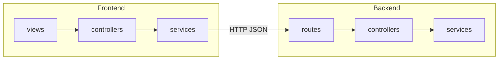
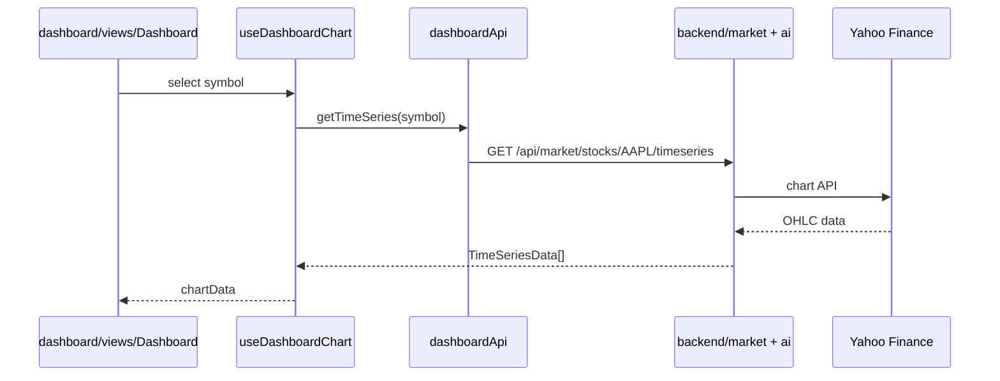

# InvestAI — Architecture Guide

This repo is a **modular monolith**: one repository, two deployable apps (`frontend`, `backend`), and a shared types package. Each **feature** is organized as its own module with an MVC-style split.

## MVC across frontend and backend

**Views exist only in the frontend.** The backend is JSON-only and has no `views/` folder, templates, or UI.

| Layer | Frontend (`apps/frontend`) | Backend (`apps/backend`) |
|-------|---------------------------|---------------------------|
| **View** | `modules/*/views/*.tsx` — React UI only | *None* — HTTP JSON responses replace a server view |
| **Controller** | `modules/*/controllers/` — hooks & providers | `modules/*/controllers/` — parse request, return JSON |
| **Model** | `modules/*/services/*Api.ts` + `@investai/shared` | `modules/*/services/` — business logic & data access |



## Top-level layout

```
financial-investment-with-gemini-insights/
├── apps/
│   ├── frontend/          # React UI (Vite)
│   └── backend/           # Express REST API (Node)
├── packages/
│   └── shared/            # TypeScript types used by both apps
├── docs/                  # Architecture & module guides (this folder)
├── .env.example           # Server secrets (copy to .env at repo root)
├── package.json           # npm workspaces root
├── README.md              # Quick start
└── FIREBASE_SETUP.md      # Firestore setup
```

| Path | Purpose |
|------|---------|
| `apps/frontend` | Browser UI only. No API keys. Talks to backend via HTTP. |
| `apps/backend` | All external integrations (Yahoo, OpenRouter, Firestore). |
| `packages/shared` | Contracts (`StockQuote`, `AIInsights`, etc.) so frontend and backend stay in sync. |
| `docs/` | Deep-dive documentation. |

---

## Backend (`apps/backend`)

Express app with **feature modules**. Each module owns routes → controllers → services.

```
apps/backend/
├── package.json
├── tsconfig.json
├── vitest.config.ts
├── .env.example
└── src/
    ├── index.ts              # Starts HTTP server on PORT (default 3001)
    ├── app.ts                # createApp(): middleware + route mounting
    ├── config/
    │   ├── env.ts            # Loads .env; exposes typed config
    │   └── firebase.ts       # Firestore client (server-side)
    ├── middleware/
    │   └── errorHandler.ts   # Central AppError + 500 handling
    ├── routes/
    │   └── index.ts          # Mounts all module routers under /api
    ├── utils/                # Cross-module helpers (not business logic)
    │   ├── asyncHandler.ts   # Wraps async controllers for Express
    │   ├── cache.ts          # In-memory TTL cache (quotes, news)
    │   ├── aiClient.ts       # OpenRouter primary + Qwen fallback
    │   ├── formatVolume.ts   # Yahoo volume formatting
    │   └── response.ts       # sendSuccess / sendError JSON shape
    ├── data/
    │   └── mockData.ts       # Symbol catalog + mock news (seed data)
    ├── modules/
    │   ├── health/           # Liveness & dependency checks
    │   ├── market/           # Stocks, news, chart time series
    │   ├── ai/               # Insights + per-stock predictions
    │   └── portfolio/        # Firestore holdings CRUD
    └── __tests__/            # QA integration tests (supertest)
```

### Module pattern (backend — no View layer)

Backend modules use **Routes → Controllers → Services**. Controllers return JSON via `sendSuccess()`; there is no View layer.

| Layer | Folder | Responsibility |
|-------|--------|----------------|
| **Routes** | `routes/*.ts` | URL → controller method |
| **Controllers** | `controllers/*.ts` | Parse request, call service, send JSON |
| **Services** | `services/*.ts` | Business logic, caching, external APIs |

### Feature modules (backend)

#### `modules/health`

| File | Role |
|------|------|
| `controllers/healthController.ts` | Builds `HealthStatus` (uptime, env + OpenRouter checks) |
| `routes/healthRoutes.ts` | `GET /api/health`, `GET /api/qa/health` |

#### `modules/market`

| File | Role |
|------|------|
| `services/marketService.ts` | Yahoo quotes (batched), mock news, time series; enriches quotes from catalog |
| `controllers/marketController.ts` | `GET /stocks`, `/news`, `/stocks/:symbol/timeseries` |
| `routes/marketRoutes.ts` | Mounted at `/api/market` |

#### `modules/ai`

| File | Role |
|------|------|
| `services/aiService.ts` | Generate insights & predictions (AI or mock fallback) |
| `services/insightsCacheService.ts` | Firestore cache for market-wide AI insights (15 min) |
| `services/predictionCacheService.ts` | Firestore cache per symbol (24 h) |
| `controllers/aiController.ts` | `GET /insights`, `POST /stocks/:symbol/prediction` |
| `routes/aiRoutes.ts` | Mounted at `/api/ai` |

#### `modules/portfolio`

| File | Role |
|------|------|
| `services/portfolioService.ts` | Read/write `portfolios_{instanceId}` in Firestore |
| `controllers/portfolioController.ts` | `GET /`, `PUT /` with holdings array |
| `routes/portfolioRoutes.ts` | Mounted at `/api/portfolio` |

### Tests

| Path | Role |
|------|------|
| `src/modules/health/__tests__/health.test.ts` | Health endpoint smoke tests |
| `src/__tests__/qa/api.qa.test.ts` | QA suite for market, AI, portfolio (mocked services) |
| `src/test/setup.ts` | Test env defaults |

Run: `npm test` from repo root.

---

## Frontend (`apps/frontend`)

React SPA. Feature code lives under `modules/`; shared UI primitives stay in `components/ui/`.

```
apps/frontend/
├── package.json
├── vite.config.ts          # Dev server + /api proxy → backend
├── tsconfig.json
├── index.html
├── main.tsx                # React entry
├── App.tsx                 # Shell: nav + view switching + providers
├── .env.example            # VITE_API_URL only
├── shared/
│   └── api/
│       └── http.ts         # Base fetch + ApiResponse parsing
├── components/
│   └── ui/                 # shadcn/Radix primitives (shared across features)
└── modules/
    ├── market/             # Global stocks + news state
    ├── dashboard/          # Charts + AI prediction per symbol
    ├── stock-comparison/   # Sortable comparison table
    ├── news/               # News feed + filters
    ├── ai-insights/        # AI recommendations UI
    └── portfolio/          # Holdings CRUD
```

### Module pattern (frontend — full MVC including View)

Only the frontend has a **View** layer. React maps MVC like this:

| MVC | Frontend | Role |
|-----|----------|------|
| **View** | `views/*.tsx` | Presentational React components (**frontend only**) |
| **Controller** | `controllers/` (hooks or providers) | State, effects, wiring view ↔ API |
| **Model** | `@investai/shared` types + module `services/` | Data shape & API calls |

### Feature modules (frontend)

#### `modules/market`

| File | Role |
|------|------|
| `services/marketApi.ts` | `getStocks()`, `getNews()` |
| `controllers/MarketDataProvider.tsx` | App-wide stocks, news, AI insights loading |
| `controllers/useMarketData.ts` | Hook for consumers |
| `index.ts` | Public exports |

#### `modules/dashboard`

| File | Role |
|------|------|
| `services/dashboardApi.ts` | Time series + stock prediction |
| `controllers/useDashboardChart.ts` | Chart load, range slice, prediction trigger |
| `views/Dashboard.tsx` | Dashboard UI |
| `index.ts` | Public exports |

#### `modules/stock-comparison`

| File | Role |
|------|------|
| `views/StockComparison.tsx` | Comparison table UI |
| `index.ts` | Re-exports view (uses `useMarketData`) |

#### `modules/news`

| File | Role |
|------|------|
| `controllers/useNewsFeed.ts` | Category filter state |
| `views/NewsFeed.tsx` | News list + article modal |
| `index.ts` | Public exports |

#### `modules/ai-insights`

| File | Role |
|------|------|
| `views/AIInsights.tsx` | Renders insights from market provider |
| `index.ts` | Public exports |

#### `modules/portfolio`

| File | Role |
|------|------|
| `services/portfolioApi.ts` | `getPortfolio()`, `savePortfolio()` |
| `controllers/PortfolioProvider.tsx` | Holdings state + price sync from stocks |
| `controllers/usePortfolio.ts` | Hook for portfolio page |
| `views/Portfolio.tsx` | Portfolio UI |
| `index.ts` | Public exports |

#### `components/ui/`

Shared design system (Button, Card, Dialog, etc.). **Not** feature-specific — imported by any module view.

---

## Shared package (`packages/shared`)

```
packages/shared/
├── package.json
├── tsconfig.json
└── src/
    ├── index.ts      # Re-exports all types
    └── types.ts      # StockQuote, AIInsights, Holding, HealthStatus, ...
```

Build before backend/frontend: `npm run build -w @investai/shared`.

---

## Request flow (example: Dashboard chart)



---

## Environment variables

| Variable | Where | Purpose |
|----------|-------|---------|
| `OPENROUTER_API_KEY` | Backend `.env` | **Required** for AI |
| `OPENROUTER_MODEL_PRIMARY` | Backend `.env` | Default: Llama 3.3 70B free |
| `OPENROUTER_MODEL_FALLBACK` | Backend `.env` | Default: Qwen3 8B free |
| `FIREBASE_*` | Backend `.env` | Firestore |
| `FIREBASE_APP_INSTANCE_ID` | Backend `.env` | Collection namespace |
| `PORT`, `CORS_ORIGIN` | Backend `.env` | Server bind + CORS |
| `VITE_API_URL` | Frontend | API base URL (empty = use Vite proxy) |

---

## Scripts (repo root)

| Command | Effect |
|---------|--------|
| `npm run dev` | Backend + frontend concurrently |
| `npm run build` | shared → backend → frontend |
| `npm test` | Backend vitest suite |

---

## Next steps: feature modules

See [FEATURE_MODULES.md](./FEATURE_MODULES.md) for conventions when adding or splitting modules.
