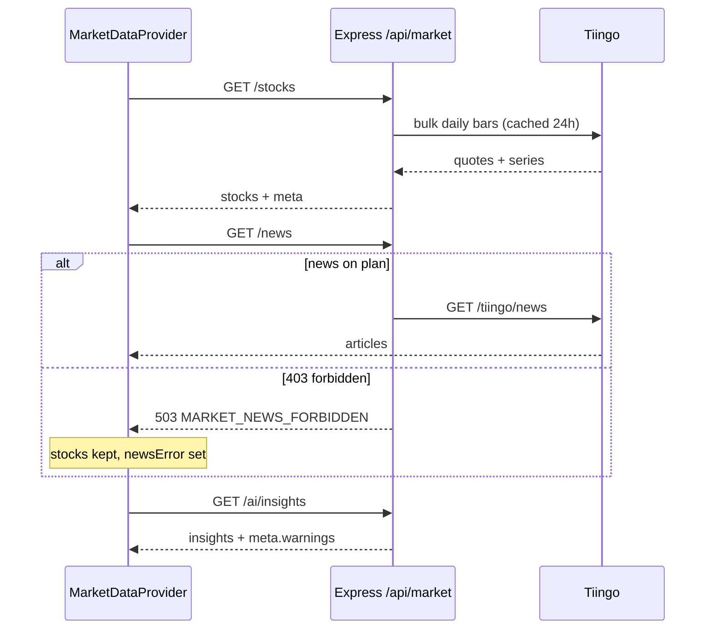
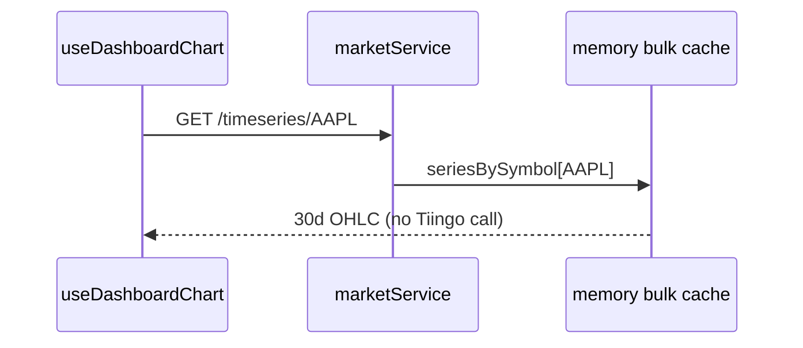

# How the app works now — agent reference

**Last updated:** 16 May 2026  
**Use this doc first** for accurate behavior. Older docs (`MARKET_DATA.md`, `CACHE.md`, parts of `ARCHITECTURE.md`, `AGENTS.md`) may still mention Yahoo Finance.

---

## 1. System in one paragraph

InvestAI is a **modular monolith**: a React SPA (`apps/frontend`) talks to an Express API (`apps/backend`) over JSON. Shared types live in `packages/shared`. **All secrets stay on the server** (`.env` at repo root). Market data is either **Mock** (static catalog in `mockData.ts`) or **Live** (Tiingo EOD + optional Tiingo News). AI uses **OpenRouter** (Llama primary, Qwen fallback), not Google Gemini. Portfolio and AI caches use **Firestore** when configured.

---

## 2. Repository map

```
apps/frontend/          React UI — modules with views/controllers/services
apps/backend/           Express — modules with routes/controllers/services
packages/shared/        TypeScript types (StockQuote, AIInsights, …)
docs/                   Documentation (this file, dev log, architecture)
.env                    Gitignored — copy from .env.example
AGENTS.md               Short agent quick-start (links here)
```

### Commands

```bash
npm install
cp .env.example .env    # fill TIINGO_API_TOKEN, OPENROUTER_API_KEY
npm run dev             # :5173 frontend, :3001 backend
npm test                # backend vitest (mocks; no Tiingo by default)
npm run build           # shared → backend → frontend
curl http://localhost:3001/api/health
```

---

## 3. Market data modes

| Mode | Provider string | Stocks | News | Charts |
|------|-----------------|--------|------|--------|
| **mock** | `mock-catalog` | Static catalog + synthetic series | `mockData.ts` articles | Synthetic from mock |
| **live** | `tiingo` | Tiingo EOD daily bars | Tiingo News API | Preloaded from bulk fetch |

### Runtime toggle

- **Header UI:** Mock ↔ Live  
- **API:** `PUT /api/market/settings` body `{ "dataMode": "live" | "mock" }`  
- **Default on boot:** `MARKET_DATA_MODE` in `.env`  
- **Switching modes** clears in-memory market cache (`setMarketDataMode` in `config/marketDataMode.ts`)

### Strict live rule

**When Live is on, the backend never returns mock catalog prices or articles.** Failures are HTTP errors (usually 503) with a `code` field. The only exception is **stale Tiingo cache** (up to 7 days old) with warnings in `meta`.

---

## 4. Tiingo data flow

### Daily stock refresh (bulk)

```
GET /api/market/stocks
  → marketService.getAllStocks()
  → [live] fetchTiingoBulk(symbols)   # batched by TIINGO_BATCH_SIZE / DELAY
  → per symbol: GET /tiingo/daily/{ticker}/prices?startDate&endDate
  → stores quotes + seriesBySymbol in memory cache (24h default)
```

- Symbol list: first `STOCK_FETCH_LIMIT` symbols from catalog (`100` default, `0` = all ~85–100).
- **One Tiingo request per symbol per cache period** — design target for free tier.

### Charts (dashboard)

```
GET /api/market/stocks/:symbol/timeseries
  → [default] read seriesBySymbol from bulk cache  → 0 API calls
  → [if TIINGO_CHART_ON_DEMAND=true] fetchTiingoDailyBars(symbol)
  → [if not preloaded and on-demand false] MARKET_CHART_NOT_PRELOADED
```

### News

```
GET /api/market/news
  → [live] fetchTiingoMarketNews() once per cache period
  → 403 on free EOD plan → MARKET_NEWS_FORBIDDEN
```

### Probe (settings health)

```
GET /api/market/settings?probe=1
  → probeTiingoProvider() — one bar fetch + optional 1-article news test
```

### Key files

| File | Role |
|------|------|
| `utils/tiingoClient.ts` | HTTP + auth header |
| `modules/market/services/tiingoProvider.ts` | Bars, bulk, news, dedupe |
| `modules/market/services/marketService.ts` | Mode routing, cache, errors |
| `config/env.ts` | All `TIINGO_*` and cache TTL env vars |

---

## 5. Caching

| What | Where | TTL | Notes |
|------|-------|-----|-------|
| Bulk quotes + chart series | Memory (`memoryCache.ts`) | `MARKET_CACHE_TTL_HOURS` (24h) | Key includes mode: `market:stocks:bulk:live` |
| News feed | Memory | Same 24h | Separate key `market:news:feed:live` |
| Stale bulk fallback | Memory | Up to 7 days | Only if fresh fetch fails; adds `meta.warnings` |
| AI insights | Firestore `aiInsights/{instanceId}` | 15 min | Skips Tiingo + OpenRouter on hit |
| Stock prediction | Firestore per symbol | 24 h | POST body must include `historicalData` |
| Frontend state | React providers | Until refresh | Not HTTP cache |

**Bypass cache:** `GET /api/market/stocks?refresh=1`, `GET /api/ai/insights?refresh=1`, header Refresh button.

Config: `apps/backend/src/config/cache.ts`.

---

## 6. AI insights flow

```
GET /api/ai/insights
  → insightsCacheService.getAIInsightsWithMeta()
  → 1) Firestore cache? (unless ?refresh=1)
  → 2) marketService.getAllStocks()
  → 3) [live] marketService.getMarketNewsWithMeta() — failures → warnings only
  → 4) generateAIInsights(stocks, news, { strict: live })
  → 5) validateAIInsights() — required sections + recommendation shape
  → 6) write Firestore cache
  → return { data: insights, meta: { warnings, stocksAnalyzed, … } }
```

### Mock vs live AI

| Mode | OpenRouter missing | AI call fails | Invalid JSON |
|------|-------------------|---------------|--------------|
| mock | `generateMockInsights()` | mock fallback | mock fallback |
| live | `AI_NOT_CONFIGURED` 503 | `AI_GENERATION_FAILED` | `AI_INVALID_RESPONSE` |

OpenRouter client: `utils/aiClient.ts` (primary model → fallback → parse JSON).

---

## 7. API reference (quick)

All success responses: `{ success: true, data: T, meta?: object }`  
Errors: `{ success: false, error: string, code?: string }`

| Method | Path | Notes |
|--------|------|-------|
| GET | `/api/health` | Env validation, Tiingo reachability hints |
| GET | `/api/market/settings` | `?probe=1` tests Tiingo |
| PUT | `/api/market/settings` | `{ dataMode }` |
| GET | `/api/market/stocks` | `?refresh=1` |
| GET | `/api/market/news` | Meta: `provider`, `count`, `fromCache` |
| GET | `/api/market/stocks/:symbol/timeseries` | Uses preload by default |
| GET | `/api/ai/insights` | `?refresh=1`; meta includes `warnings` |
| POST | `/api/ai/stocks/:symbol/prediction` | Body: `{ historicalData: [{date, price}] }` |
| GET/PUT | `/api/portfolio` | Firestore holdings |

---

## 8. Error codes (complete list for agents)

### Market

| Code | HTTP | Meaning / fix |
|------|------|----------------|
| `MARKET_LIVE_UNAVAILABLE` | 503 | Set `TIINGO_API_TOKEN` or use Mock; check 429/rate limits |
| `MARKET_NEWS_FORBIDDEN` | 503 | Tiingo News not on plan — use Mock news or upgrade |
| `MARKET_NEWS_UNAVAILABLE` | 503 | Other news failure |
| `MARKET_CHART_NOT_PRELOADED` | 503 | Symbol missing from bulk; run stock refresh or enable `TIINGO_CHART_ON_DEMAND` |
| `INVALID_MARKET_MODE` | 400 | Bad `dataMode` value |

### AI

| Code | HTTP | Meaning / fix |
|------|------|----------------|
| `AI_NOT_CONFIGURED` | 503 | Set `OPENROUTER_API_KEY` or use Mock |
| `AI_INSUFFICIENT_MARKET_DATA` | 503 | Load stocks first (live Tiingo may have failed) |
| `AI_INVALID_RESPONSE` | 502 | Model returned bad JSON — retry or change model |
| `AI_GENERATION_FAILED` | 502 | OpenRouter/network error |
| `MARKET_DATA_UNAVAILABLE` | 503 | Stocks could not load for insights pipeline |

---

## 9. Frontend architecture

### Entry and providers

`apps/frontend/App.tsx` wraps:

1. `MarketDataProvider` — stocks, news, mode, errors  
2. `AIInsightsProvider` — insights, AI errors/warnings  
3. `PortfolioProvider` — holdings  

### Module table

| Module | View | Controller | API service |
|--------|------|------------|-------------|
| market | — | `MarketDataProvider` | `marketApi.ts` |
| dashboard | `Dashboard.tsx` | `useDashboardChart` | `dashboardApi.ts` |
| stock-comparison | `StockComparison.tsx` | — | uses market context |
| news | `NewsFeed.tsx` | `useNewsFeed` | uses market context |
| ai-insights | `AIInsights.tsx` | `AIInsightsProvider` | `aiApi.ts` |
| portfolio | `Portfolio.tsx` | `PortfolioProvider` | `portfolioApi.ts` |
| shared | `StatusBanner.tsx` | — | — |

### Error display rules

- **Stocks failed:** `MarketDataBanner` red error; news may not load.  
- **Stocks OK, news failed (live):** amber warning + `newsError` on News tab; dashboard still works.  
- **AI failed:** `AIInsights` shows `StatusBanner` + Retry (`refreshInsights(true)`).  
- **AI OK with news warning:** insights render; amber warnings in banner.

### HTTP

- Dev: `VITE_API_URL` empty → Vite proxies `/api` → `localhost:3001`  
- `ApiError` includes `status` and `code` from backend body  

---

## 10. Environment variables (backend)

| Variable | Required | Purpose |
|----------|----------|---------|
| `TIINGO_API_TOKEN` | Live mode | Tiingo EOD + news |
| `OPENROUTER_API_KEY` | AI in live | `sk-or-…` |
| `MARKET_DATA_MODE` | No | Default `live` or `mock` |
| `MARKET_CACHE_TTL_HOURS` | No | Default 24 |
| `STOCK_FETCH_LIMIT` | No | Default 100 |
| `TIINGO_BATCH_SIZE` | No | Default 3 |
| `TIINGO_BATCH_DELAY_MS` | No | Default 500 |
| `TIINGO_CHART_ON_DEMAND` | No | Default false |
| `TIINGO_NEWS_LIMIT` | No | Default 50 |
| `FIREBASE_*` | No | Portfolio + AI cache |
| `PORT`, `CORS_ORIGIN` | No | Server |

Frontend: `VITE_API_URL` optional (production API URL).

---

## 11. Data flow diagrams

### App load (live mode)



### Chart click (default config)



---

## 12. Testing guide for agents

| Test | Command | Notes |
|------|---------|-------|
| Unit + QA | `npm test` | Mocks services; no Tiingo network |
| Live Tiingo | `npm run test:tiingo` | Needs token; may 429 |
| Health | `curl localhost:3001/api/health` | Check `env.missing` |

QA file: `apps/backend/src/__tests__/qa/api.qa.test.ts` — always mock `getAIInsightsWithMeta`, not `getAIInsights`.

When adding endpoints: extend QA test + frontend `*Api.ts` + optional `StatusBanner` code mapping.

---

## 13. Common agent tasks

| Task | Where to change |
|------|-----------------|
| Change AI models | `.env` `OPENROUTER_MODEL_*` or `config/env.ts` defaults |
| Add API route | `modules/*/routes` → controller → service → frontend `*Api.ts` |
| Change cache TTL | `config/cache.ts` + `MARKET_CACHE_TTL_HOURS` |
| New error code | `AppError` in service + `StatusBanner.errorTitle()` switch |
| Add stock symbol | `apps/backend/src/data/mockData.ts` catalog |
| Debug empty live UI | Network tab → `/api/market/stocks` status; then `/api/health` |
| Rate limit 429 | Wait for hourly reset; lower `STOCK_FETCH_LIMIT`; keep `TIINGO_CHART_ON_DEMAND=false` |

---

## 14. Conventions (do not break)

1. **No `fetch` in views** — use module services.  
2. **No `views/` on backend.**  
3. **Types** only in `@investai/shared` — rebuild package after edits.  
4. **No mock fallback in live mode** for market data.  
5. **TTL constants** in `config/cache.ts`, not scattered magic numbers.  
6. **Controllers stay thin** — logic in services.

---

## 15. Related documents

| Doc | Use when |
|-----|----------|
| [DEV_LOG_2026-05-16.md](./DEV_LOG_2026-05-16.md) | What changed today and why |
| [CODEBASE_MAP.md](./CODEBASE_MAP.md) | File-by-file paths (verify against this doc) |
| [ARCHITECTURE.md](./ARCHITECTURE.md) | MVC diagrams (partially outdated on Yahoo) |
| [FEATURE_MODULES.md](./FEATURE_MODULES.md) | Adding new modules |
| [AGENTS.md](../AGENTS.md) | Short quick-start |

---

## 16. Troubleshooting cheat sheet

| Symptom | Likely cause | Action |
|---------|--------------|--------|
| All stocks 503 live | Missing/invalid `TIINGO_API_TOKEN` | Set token or Mock mode |
| 429 in logs | Hourly Tiingo limit | Wait; reduce symbols; no chart on-demand |
| News 503, stocks OK | Free tier without News API | Expected; use Mock or upgrade Tiingo News |
| Chart 503 `NOT_PRELOADED` | Bulk failed for symbol | Refresh stocks; check failedSymbols in meta |
| AI 503 `NOT_CONFIGURED` | No OpenRouter key in live | Add key or Mock mode |
| Insights empty, no error | Still loading or provider not mounted | Check `AIInsightsProvider` |
| Firestore permission errors | Rules not set | See `FIREBASE_SETUP.md`; app still runs in-memory |

---

*This document is the canonical “how it works” reference for coding agents. Update it when behavior changes.*
