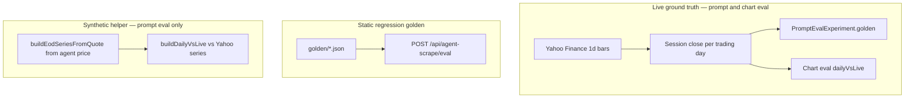
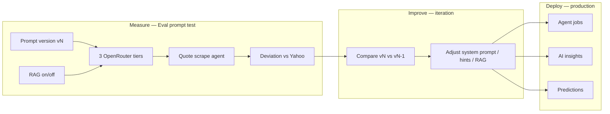
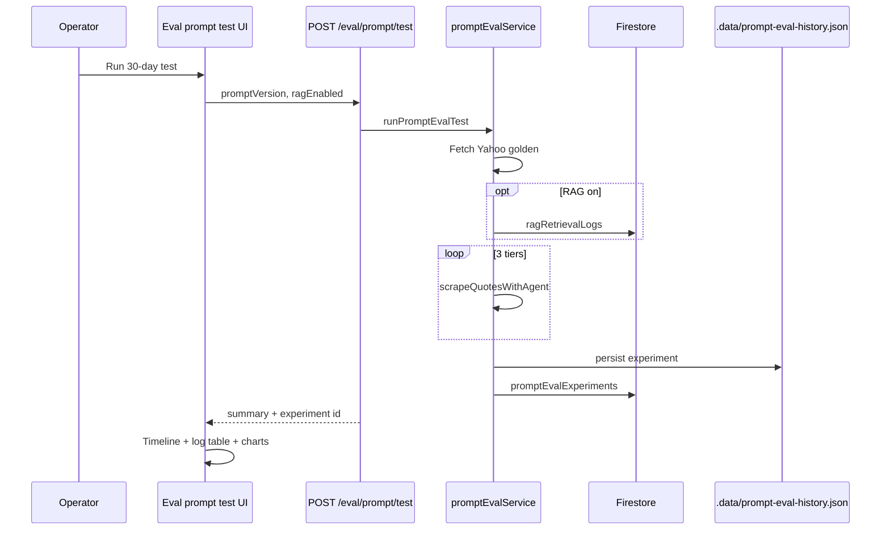

# InvestAI — system capabilities & prompt engineering

**Last updated:** 18 May 2026  
**Audience:** Engineers, operators, and reviewers who need to understand what the product does today and how we measure whether prompts and RAG improve financial outputs.

**Related:** [DEV_LOG_2026-05-18.md](./DEV_LOG_2026-05-18.md) · [AGENT_EVALS.md](./AGENT_EVALS.md) · [HOW_IT_WORKS_NOW.md](./HOW_IT_WORKS_NOW.md) · [ARCHITECTURE.md](./ARCHITECTURE.md)

---

## 1. What InvestAI is

InvestAI is a **financial dashboard** monorepo:

| Layer | Stack | Role |
|-------|--------|------|
| Frontend | React + Vite (`apps/frontend`) | Dashboard, portfolio, news, AI insights, eval dashboards |
| Backend | Express (`apps/backend`) | REST API, OpenRouter, Yahoo/Tiingo, Firestore |
| Shared | TypeScript (`packages/shared`) | Types, EOD conventions, eval records |

Secrets live in repo-root `.env` only. The browser never sees API keys.

---

## 2. Everything the system can do today

### 2.1 Market data (dashboard)

| Mode | Quotes & charts | News | Provider |
|------|-----------------|------|----------|
| **Mock** | Static catalog | Demo catalog | `mock-catalog` |
| **Live** | Yahoo (default) or Tiingo | Tiingo or catalog fallback | `yahoo` / `tiingo` |
| **Agent** | From **quote source** (Live or Mock) | Same as quote source | N/A for quotes |

**Agent mode** is not a third quote provider. It is a **30-day LLM chart job** workflow:

- Toggle **Agent** → agent scrape panel (tier picker, cost estimate, Start).
- Quotes/news still come from **Live** or **Mock** (`quoteDataMode`).
- Completed jobs write **LLM 30-day OHLC** into agent cache for chart overlay.

**Operations:** Daily cache (`MARKET_CACHE_TTL_HOURS`, default 24h), `?refresh=1` on stocks, strict live errors (503, no silent mock fallback).

### 2.2 AI features (OpenRouter)

| Feature | Endpoint | Input | Output |
|---------|----------|-------|--------|
| **AI insights** | `GET /api/ai/insights` | Enriched stocks + news | Recommendations, trends, risks, portfolio hints, stats (JSON) |
| **Stock prediction** | `POST /api/ai/stocks/:symbol/prediction` | `historicalData[]` + symbol | `StockPrediction` (cached in Firestore when configured) |
| **Agent quote scrape** | Inside jobs / prompt eval | Symbol list + prompts | Structured `StockQuote[]` |
| **Agent 30d charts** | Inside jobs (`scrapeCharts`) | Symbols + anchor prices | `TimeSeriesData[]` per symbol |

Models: `OPENROUTER_MODEL_PRIMARY` / `FALLBACK`; agent tiers via `AI_COST_TIERS` (`cheapest`, `cheaper`, `cheap`).

### 2.3 Portfolio

| Endpoint | Behavior |
|----------|----------|
| `GET/PUT /api/portfolio` | Holdings in Firestore (optional) |

### 2.4 Authentication

Optional **demo gate** when `DEMO_AUTH_USER` and `DEMO_AUTH_PASSWORD` are set (e.g. `design-bakery` / `design-bakery-3645`). JWT Bearer on API calls; `POST /api/auth/login` issues token.

### 2.5 Eval & quality (three dashboards + APIs)

| Dashboard (UI) | Measures | Auto-logged? |
|----------------|----------|--------------|
| **Estimate eval** | Pre-scrape token/cost estimate vs actual usage | Yes, after each agent job |
| **Agent run history** | Quote vs chart closes; agent vs **Yahoo EOD** | Yes, after each job with charts |
| **Eval prompt test** | **Three LLM tiers** vs **Yahoo golden**; optional **RAG** | On experiment / test only |

**Storage (eval only):** browser localStorage → sync → server disk (`.data/*-history.json`) → Firestore collections when Firebase is configured.

### 2.6 Regression golden (API / CI)

Static JSON fixtures under `apps/backend/src/modules/agent-scrape/golden/`:

| File | Kind |
|------|------|
| `quotes-core.json` | Quote field bands for AAPL, MSFT, GOOGL |
| `quotes-finance.json` | Additional quote cases |
| `news-market.json` | News structure |

`GET /api/agent-scrape/golden` · `POST /api/agent-scrape/eval` — runs quote/news agents against expected shapes (not the same as Yahoo live golden in prompt eval).

### 2.7 Usage limits (cost protection)

| Bucket | Trigger | Anonymous | Signed in |
|--------|---------|-----------|-----------|
| `agent-run` | `POST /jobs` with `forceLive: true` | 1h between runs | 15m + 5/day |
| `prompt-test` | Prompt eval test / experiment | 1h between runs | 15m + 5/day |

`GET /api/agent-scrape/usage-limits` returns both statuses.

---

## 3. Ground truth & golden datasets

We use **three related “golden” concepts** — do not confuse them:



### 3.1 Yahoo EOD (primary ground truth)

- **Source:** `yahoo-finance2` — `interval: 1d` daily bars.
- **Convention:** `CHART_EOD_CONVENTION` — each point is **session close** for that trading day; latest bar = most recent session ([`packages/shared/src/tradingDays.ts`](../packages/shared/src/tradingDays.ts)).
- **Used when:**
  - Starting a **prompt eval experiment** — fetch bars per symbol → store `golden: [{ symbol, yahooClose, yahooPreviousClose }]`.
  - Finishing an **agent chart job** — fetch Yahoo series → `dailyVsLive` per symbol in chart eval.
- **Why Yahoo:** Reproducible, key-aligned comparison via `buildDailyVsLive(agentSeries, yahooSeries)` on matching `YYYY-MM-DD` dates.

### 3.2 Prompt eval golden (embedded per experiment)

Stored on each `PromptEvalExperiment`:

```typescript
golden: [{ symbol, yahooClose, yahooPreviousClose }]
goldenReference: 'yahoo'
evalWindowDays: 30
comparisonMode: '30d-eod'
```

Passed into the quote agent as **golden hint** text:

```text
Golden reference (Yahoo EOD — prefer last session close):
AAPL: last EOD close $xxx.xx
...
```

### 3.3 Static golden files (regression)

Band-based expectations (price min/max, required fields) for automated eval runner — see `goldenMatcher.ts`. Does not power the eval dashboards directly.

---

## 4. How prompt engineering improves the system

Prompt engineering here does **not** retrain a single “prediction model.” It improves **downstream quality** by making agent-extracted prices and EOD-shaped series **closer to observable market data**, which then feeds:

1. **Dashboard charts** (when using agent job output).
2. **AI insights** (`GET /api/ai/insights`) — prompts include live prices and news.
3. **Stock predictions** (`POST .../prediction`) — prompts include `historicalData` from the client; better market pipeline → better inputs.



### 4.1 Quote scrape agent (core prompt)

**File:** `apps/backend/src/modules/agent-scrape/services/agents/quoteScrapeAgent.ts`

| Input | Effect |
|-------|--------|
| `SYSTEM_PROMPT` | JSON-only financial extraction agent; OHLC + volume shape |
| User prompt | Symbol list |
| `goldenHint` | Yahoo last closes — steers model toward ground truth |
| `ragContext` | Retrieved catalog/news passages — company context only |

**Measured metrics per tier:**

| Metric | Meaning |
|--------|---------|
| `quoteDeviationPct` | Agent last price vs `yahooClose` |
| `avgAbsQuoteDeviationPct` | Mean across symbols |
| `dailyVsLive` | Per-day agent EOD vs Yahoo close (`deviationPct`) |
| `avgAbsDailyDeviationPct` | Mean absolute daily deviation |

Lower deviation → better prompt + hint + RAG configuration.

### 4.2 Chart scrape agent (30-day series)

**File:** `chartScrapeAgent.ts`

- Prompt includes **explicit list of 30 trading day dates** (`lastTradingDayKeys`).
- Output aligned to those dates before eval.
- Compared to Yahoo in **Agent run history** (not the 3-tier prompt eval).

### 4.3 AI insights & predictions (separate prompts)

| Service | Prompt style |
|---------|----------------|
| `aiService.buildInsightsPrompt` | Analyst JSON: recommendations, trends, risks from stocks + news |
| `generateStockPrediction` | Uses client-supplied `historicalData` + symbol |

Prompt eval does **not** automatically rewrite these prompts today; improvement is validated on **quote agent** first, then operators apply learnings manually.

### 4.4 Improvement tracking (experiments)

Each `PromptEvalExperiment.improvement`:

| Field | Use |
|-------|-----|
| `previousExperimentId` | Link to prior run |
| `avgQuoteDeviationDeltaPct` | Did best tier get closer on **spot quote**? |
| `avgDailyDeviationDeltaPct` | Closer on **30-day EOD shape**? |
| `bestTier` | Which tier won this run |

**Visual:** timeline subtitle + improvement badge + tier summary bars in UI.

---

## 5. RAG (retrieval-augmented generation)

### 5.1 What is indexed

**File:** `ragService.ts`

| Source | Chunk content |
|--------|----------------|
| `mockStocks` catalog | Name, sector, market cap, P/E — **not prices** |
| `mockNews` | Title, summary, sentiment per related ticker |

Chunks stored in memory + Firestore `ragChunks` (7-day TTL).

### 5.2 Retrieval at experiment time

```typescript
retrieveRagForSymbols(symbols, limitPerSymbol = 2)
// → { chunks, contextBlock }
```

`contextBlock` appended to quote scrape prompt. Prices must still align with **Yahoo golden hint**.

### 5.3 Event logging (visual proof)

When `ragEnabled: true`:

1. **`RagRetrievalLog`** written to Firestore `ragRetrievalLogs`:
   - `experimentId`, `symbols`, `chunkIds`, `snippets`, `sources`
2. **`PromptEvalExperiment.rag`** stores summary:
   - `chunksRetrieved`, `chunkIds`, `snippets`, `retrievalLogId`
3. **UI `RagFlowPanel`** shows pipeline steps + snippet preview.
4. **UI fetches** `GET /api/agent-scrape/eval/prompt/:id/rag` for full log in detail view.

**A/B test:** Run same `promptVersion` with `ragEnabled: false` vs `true`; compare `avgAbsQuoteDeviationPct` on timeline.

---

## 6. Event logging & visual proof

### 6.1 What gets logged (prompt eval)

| Artifact | Location | Contents |
|----------|----------|----------|
| Full experiment | `PromptEvalExperiment` | golden, tiers[], rag, improvement, metadata |
| RAG retrieval | `RagRetrievalLog` | chunk ids, snippets, sources |
| Test API summary | `PromptEvalTestSummary` | headline, best tier, deviations (short response) |
| Run log excerpt | UI monospace block | Human-readable one-run transcript |

Example excerpt shape (UI):

```text
[2026-05-18T...] prompt=v-2026-05-18 id=<uuid>
golden=yahoo symbols=AAPL,MSFT,...
  tier cheapest (...): quoteDev=2.31% dailyDev=1.05% tokens=1234
  tier cheaper  (...): quoteDev=1.88% dailyDev=0.92% tokens=1456
  tier cheap    (...): quoteDev=1.52% dailyDev=0.81% tokens=1678
  RAG chunks=4 ids=catalog-AAPL, news-AAPL-...
  vs prev <prev-id>: quoteΔ=-0.40%
```

### 6.2 Charts as visual proof (Eval prompt test)

**Component:** `PromptEvalCharts.tsx`

| Chart | What it proves |
|-------|----------------|
| Quote bars (all symbols) | Yahoo green bar vs 3 tier agent prices side-by-side |
| EOD line (one symbol) | **4 lines** — Yahoo + 3 tiers across 30 days |
| Daily deviation bars | Per-tier % error vs Yahoo by trading day |
| Tier summary | \|quote−Yahoo\| %, \|EOD−Yahoo\| %, tokens |

### 6.3 Charts as visual proof (Agent run history)

**Component:** `ChartEvalRunDetail.tsx`

| Chart | What it proves |
|-------|----------------|
| Agent vs Yahoo line | **2 lines** — one job, one tier, 30-day EOD |
| Deviation chart | Signed and absolute % vs Yahoo by day |
| Cross-symbol bars | avg deviation across universe |

### 6.4 Persistence flow (audit trail)



---

## 7. API reference (eval & quality)

| Method | Path | Purpose |
|--------|------|---------|
| GET | `/api/agent-scrape/usage-limits` | Both limiter statuses |
| GET | `/api/agent-scrape/eval/estimates` | Estimate eval history |
| GET | `/api/agent-scrape/eval/charts` | Chart / agent run history |
| GET | `/api/agent-scrape/eval/prompt` | Prompt eval history |
| POST | `/api/agent-scrape/eval/prompt` | Full experiment |
| POST | `/api/agent-scrape/eval/prompt/test` | Experiment + **short summary** |
| GET | `/api/agent-scrape/eval/prompt/cooldown` | Prompt-test limiter only |
| GET | `/api/agent-scrape/eval/prompt/:id/rag` | RAG logs for experiment |
| POST | `/api/agent-scrape/eval/*/sync` | Merge browser local runs to server |
| GET | `/api/agent-scrape/golden` | List static regression cases |
| POST | `/api/agent-scrape/eval` | Run static golden eval |

---

## 8. Operator playbook (prompt iteration)

1. **Baseline** — Run eval prompt test: `ragEnabled: false`, note `promptVersion`, save best-tier deviation.
2. **Change one variable** — Edit quote `SYSTEM_PROMPT` or hint wording (or enable RAG).
3. **Re-run** — Same symbol limit; new `promptVersion` string.
4. **Compare** — Open both runs in timeline; read `improvement` delta and EOD line charts.
5. **Promote** — If better, use updated prompts in production agent jobs; monitor **Agent run history** vs Yahoo.

**Success heuristic:** Lower `avgAbsQuoteDeviationPct` and `avgAbsDailyDeviationPct` without unacceptable token cost (`tokensUsed` per tier on summary chart).

---

## 9. Known limitations (honest)

| Topic | Limitation |
|-------|------------|
| Yahoo vs exchange | Yahoo bars are ground truth for **eval**, not legal settlement prices |
| Trading calendar | `lastTradingDayKeys` skips weekends; not full NYSE holiday calendar |
| Prompt eval EOD series | Built from agent quote via `buildEodSeriesFromQuote` for daily comparison — not LLM OHLC (chart eval uses LLM OHLC) |
| RAG index | Demo catalog + mock news only — not live wire ingest |
| Unified golden cache | Planned (`goldenSnapshotId`); each run still fetches Yahoo |
| Prediction loop | No automatic closed-loop from eval score to prediction prompt yet |

---

## 10. Success criteria (product)

- Operators can run **Eval prompt test**, see **3 tiers + Yahoo** on one chart, and **RAG evidence** on the same screen.
- Operators can run **Agent run history** after jobs and see **2-line** Yahoo comparison per symbol.
- Every prompt experiment is **logged** (disk + Firestore + UI table/timeline) with **improvement vs previous**.
- Agent mode no longer burns OpenRouter tokens on **daily bulk quote** refresh.
- Usage limits protect **agent-run** and **prompt-test** budgets separately.

---

## 11. Code map (quick)

| Concern | Path |
|---------|------|
| Prompt eval orchestration | `apps/backend/.../promptEvalService.ts` |
| RAG | `apps/backend/.../ragService.ts` |
| Quote agent | `apps/backend/.../agents/quoteScrapeAgent.ts` |
| Chart agent | `apps/backend/.../agents/chartScrapeAgent.ts` |
| Eval persistence | `apps/backend/src/utils/evalPersistence.ts` |
| Shared types | `packages/shared/src/promptEval.ts` |
| Prompt eval UI | `apps/frontend/.../PromptEvalDashboard.tsx`, `eval/PromptEvalCharts.tsx`, `eval/RagFlowPanel.tsx` |
| Agent history UI | `apps/frontend/.../ChartEvalDashboard.tsx`, `eval/ChartEvalRunDetail.tsx` |
| Run log table | `apps/frontend/.../eval/EvalRunLogTable.tsx` |
