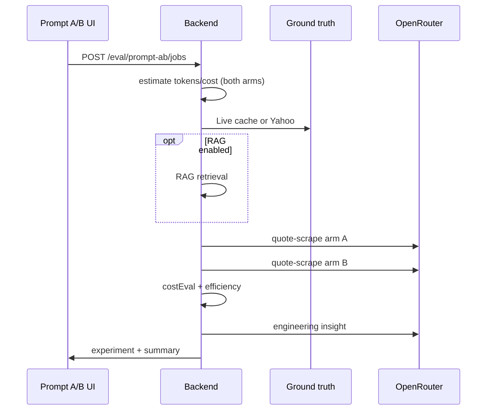

# Prompt A/B testing — study guide

How InvestAI compares **quote-scrape** prompt versions without changing the main dashboard.

---

## Why a separate tab?

The **main dashboard** and **agent scrape jobs** always use `PROMPT_LATEST` from `@investai/prompts` (today: `2026-05-19`). Experimental prompts would risk production UX if wired there directly.

The **Prompt A/B** nav item (`prompt-ab`) is an isolated eval lab:

- Run **arm A** and **arm B** on the **same symbols** and **same ground truth snapshot**
- Measure accuracy vs **Live mode cached EOD** (preferred) or Yahoo fallback
- Log results in a **table + timeline**; open any run for charts, cost tables, and AI insight

---

## Ground truth (what “correct” means)

| Source | When used |
|--------|-----------|
| **Live localStorage bulk** | Fresh `investai-market-stocks-live-v1` (&lt; 12h) sent from the browser |
| **Server Yahoo** | Cache miss — per-symbol Yahoo chart bars |

Field names still say `yahooClose` historically; values may come from **Tiingo** if that is what Live mode cached.

Comparison window: **30 trading-day EOD** (not a single spot check). Daily series for the agent arm is **synthetic from the scraped quote** (`buildEodSeriesFromQuote`), same as the 3-tier prompt eval tab.

---

## Default arms

| Arm | Default version | Label |
|-----|-----------------|-------|
| A | `2026-05-19` | Production quote-scrape |
| B | `2026-05-20` | v2 — live-cache anchor (A/B only) |

Pick other versions from the catalog dropdown (`GET /api/agent-scrape/prompts`).

---

## Run pipeline



Steps shown in the job progress UI: estimate → ground truth → (RAG) → arm A → arm B → insight.

---

## Metrics explained

### Accuracy (primary)

- **Quote deviation %** — `|agentPrice − groundTruthClose| / groundTruthClose`
- **Daily deviation %** — 30-day EOD path vs ground truth series
- **Winner** — lower average quote deviation wins; daily breaks ties

### Cost (estimate vs actual)

Mirrors **Estimate eval** (`AgentEstimateEvalRecord`):

| Field | Meaning |
|-------|---------|
| `costEval.estimate` | Pre-run token/cost for **two** quote-scrape calls |
| `costEval.actual` | Sum of arm A + arm B usage |
| `costDeltaPercent` | `(actual − estimate) / estimate` |
| `costEval.accuracy` | `excellent` / `good` / `fair` / `poor` from token delta % |

Pre-run estimate uses ~900 prompt + ~700 completion tokens **per arm** (scaled slightly for &gt;5 symbols). See `promptAbTestEstimate.ts`.

### Efficiency (gain / loss)

**Lower is better** — less deviation per unit spend:

- `accuracyPer1kTokens` = `avgAbsQuoteDeviationPct / (tokens / 1000)`
- `accuracyPerCentUsd` = deviation per cent of USD

Compare arms:

- `moreEfficientArm` — which prompt delivers lower deviation per 1k tokens
- `accuracyPerTokenGainPct` — B vs A improvement on that metric (positive ⇒ B more efficient)
- `costDeltaUsd` — B total cost minus A

A prompt can **win on accuracy** but **lose on efficiency** if it uses many more tokens.

### AI engineering insight

After metrics are computed, one extra LLM call (`promptAbInsightService.ts`) receives:

- Both arms’ deviation, tokens, cost, efficiency
- Winner and cost estimate delta
- Short reasoning excerpts

Returns JSON:

```json
{
  "summary": "...",
  "recommendations": ["..."],
  "promptTweaks": ["..."]
}
```

Displayed in the run detail panel — use it to iterate `packages/prompts/src/templates/quote-scrape.ts`, then re-run A/B.

---

## UI map

| Area | Component |
|------|-----------|
| Nav | **Prompt A/B** (`App.tsx`) |
| Run controls | `PromptAbDashboard.tsx` |
| History table | `EvalRunLogTable` |
| Timeline | `EvalRunTimeline` |
| Detail | `PromptAbRunDetail.tsx` |
| Cost table | `PromptAbCostPanel.tsx` |
| Insight | `PromptAbInsightPanel.tsx` |
| Charts | `PromptAbCharts.tsx` |

---

## What is *not* in A/B today

- **Chart-scrape** prompts (agent jobs only) — see [PROMPT_ENGINEERING.md](./PROMPT_ENGINEERING.md) batching case study
- **Three-tier** comparison (that is **Eval prompt test** tab)
- Auto-promotion of winner to `PROMPT_LATEST` — manual decision after reviewing insight + charts

---

## Operational tips

1. **Live mode first** — refresh stocks so ground truth uses cached Live bulk (banner warns if stale).
2. **One tier for both arms** — fair comparison; default `cheaper` middle tier.
3. **RAG off** for pure prompt diff; **RAG on** to test grounding with context on both arms.
4. **Cooldown** — shares `prompt-test` usage limits with the 3-tier eval tab.
5. **Symbol count** — uses `PROMPT_EVAL_DEFAULT_SYMBOL_LIMIT` (3) for A/B; agent chart jobs use `AGENT_SCRAPE_SYMBOL_LIMIT` (default **10**).

---

## Related docs

- [AGENT_EVALS.md](./AGENT_EVALS.md) — all eval dashboards
- [PROMPT_ENGINEERING.md](./PROMPT_ENGINEERING.md) — registry and chart batching
- [DEV_LOG_2026-05-20.md](./DEV_LOG_2026-05-20.md) — today’s implementation log
