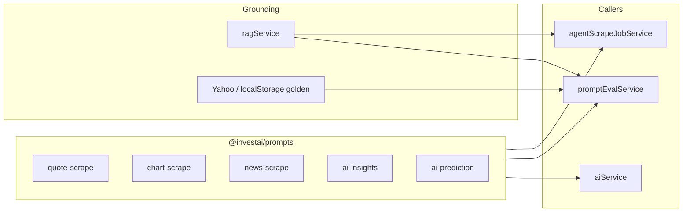

# Prompt engineering study guide — InvestAI

This document is the **canonical reference** for how LLM prompts are versioned, evaluated, and improved in this repo. Use it for demos, coursework, and iteration.

## Why versioning matters

Before May 2026, prompt text lived inline in agent files and `promptVersion` on prompt-eval runs was only a **label** — changing code changed behavior for all historical runs retroactively.

We now use **`@investai/prompts`**: a small registry where each surface has dated templates (`2026-05-16`, `2026-05-19`, …). Runs store **`promptSuite`** (resolved versions) on jobs and experiments.

## Architecture

## Prompt surfaces

| Prompt ID | File templates | Used by | Latest version |
|-----------|----------------|---------|----------------|
| `quote-scrape` | `packages/prompts/src/templates/quote-scrape.ts` | Prompt eval (3 tiers), legacy full agent jobs | `2026-05-19` |
| `chart-scrape` | `packages/prompts/src/templates/chart-scrape.ts` | Agent **Start** (home tab, charts-only) | `2026-05-19` |
| `news-scrape` | `packages/prompts/src/templates/news-scrape.ts` | Full agent jobs (news step) | `2026-05-16` |
| `ai-insights` | `packages/prompts/src/templates/ai-insights.ts` | `/api/ai/insights` | `2026-05-16` |
| `ai-prediction` | `packages/prompts/src/templates/ai-prediction.ts` | `/api/ai/stocks/:symbol/prediction` | `2026-05-16` |

**API catalog:** `GET /api/agent-scrape/prompts` → `{ latest, catalog[] }`.

## Version changelog (shipped)

### Quote scrape `2026-05-16` (baseline)

- JSON quotes + optional `reasoning`.
- User prompt accepts **goldenHint** (Yahoo EOD) and **ragContext** blocks.

### Quote scrape `2026-05-19` (RAG + golden)

- Root JSON includes `promptVersion: "2026-05-19"`.
- System text: golden EOD within 0.5%, RAG for names/sectors only.
- Selected when eval UI sends `v-2026-05-19` or `2026-05-19`.

### Chart scrape `2026-05-16` (baseline)

- 30 trading-day OHLC as compact `bars` arrays.
- Calendar from `lastTradingDayKeys(30)` in user prompt.

### Chart scrape `2026-05-19` (RAG)

- Same schema; optional per-symbol RAG block (catalog + news chunks).
- Production jobs: `AGENT_SCRAPE_RAG=true` (default) hydrates context before each symbol.

## RAG (retrieval-augmented generation)

**Index:** `apps/backend/src/modules/agent-scrape/services/ragService.ts`

- Chunks: mock **stock catalog** (sector, cap, P/E) + first 12 **mock news** articles.
- Stored: memory → Firestore `ragChunks` (7-day TTL).
- Retrieval: filter by symbol, up to 2 chunks each.
- Format: `formatRagContextBlock()` in `@investai/prompts` (shared prefix text).

| Flow | RAG enabled? |
|------|----------------|
| Prompt eval (toggle) | Yes — `ragEnabled` on POST body |
| Agent chart job | Yes — `AGENT_SCRAPE_RAG` (default on) |
| Agent quote batches (legacy full job) | No golden/RAG in v1 path unless extended |
| Chart / estimate eval | **No** — metrics only, no LLM |

**Important:** RAG grounds **company context**, not prices. Prices for eval come from **Yahoo golden** or client `localStorage` ground truth.

## Eval systems (three dashboards)

### 1. Prompt eval — *prompt quality vs Yahoo*

- **UI:** Prompt eval view · **API:** `POST /api/agent-scrape/eval/prompt`
- Runs **three tiers** (cheap / mid / strong OpenRouter models).
- Compares agent quote + 30-day synthetic EOD vs Yahoo bars.
- Stores `promptVersion` (label) + `promptSuite.quoteScrape` (resolved).
- Optional RAG + improvement delta vs previous experiment.

### 2. Chart eval — *quote vs chart alignment*

- **No prompt changes** — records how well LLM 30-day bars match quote-implied EOD and Yahoo.
- Built in `chartEvalService.ts` when agent job completes.

### 3. Estimate eval — *cost estimate accuracy*

- Compares pre-scrape token estimate vs actual usage.
- **No prompts** — `estimateEvalService.ts` + shared `buildEstimateEvalFromJob`.

### 4. Static golden eval (regression)

- `POST /api/agent-scrape/eval` — JSON fixtures in `golden/*.json`.
- Shape/price band checks; separate from Yahoo prompt eval.

## Iteration workflow (recommended)

1. **Copy** a template in `packages/prompts/src/templates/` → new date version.
2. Register in `registry.ts` → bump `PROMPT_LATEST` for that id.
3. Run **prompt eval** with `promptVersion: "v-YYYY-MM-DD"` and RAG on.
4. Compare timeline in UI (avg quote deviation, daily vs live).
5. When satisfied, latest pointer picks it up for **new** agent jobs automatically.
6. Document changes in `docs/DEV_LOG_YYYY-MM-DD.md`.

## What chart eval does *not* do

Chart eval does **not** select or version prompts. It only measures outcomes after a scrape. To improve charts, version **`chart-scrape`** and re-run Agent **Start**.

## Environment

| Variable | Default | Purpose |
|----------|---------|---------|
| `AGENT_SCRAPE_RAG` | `true` | Per-symbol RAG on chart scrape jobs |
| `OPENROUTER_API_KEY` | — | All LLM calls |
| `MARKET_CACHE_TTL_HOURS` | `12` | Aligns with stale chart/quote windows |

## Further reading

- [PROJECT_SCOPE.md](./PROJECT_SCOPE.md) — product capabilities
- [AGENT_EVALS.md](./AGENT_EVALS.md) — eval storage & APIs
- [AGENT_SCRAPE.md](./AGENT_SCRAPE.md) — job orchestration
- [DEV_LOG_2026-05-19.md](./DEV_LOG_2026-05-19.md) — registry + RAG on charts
