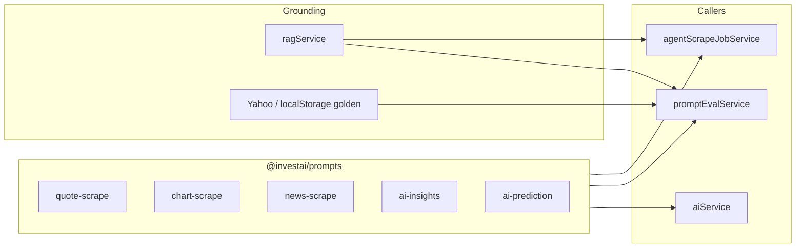
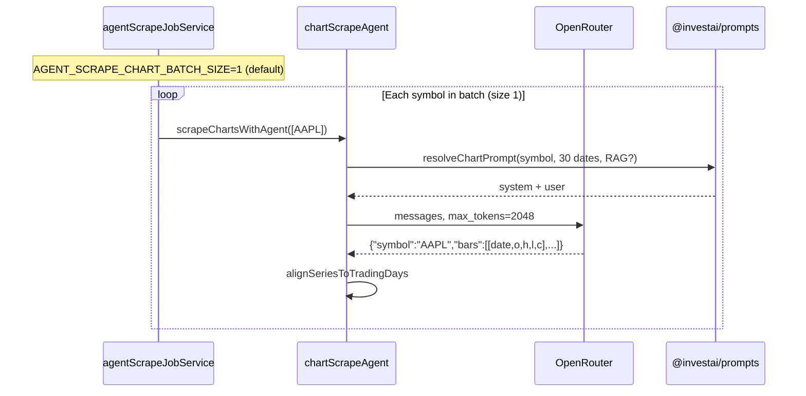
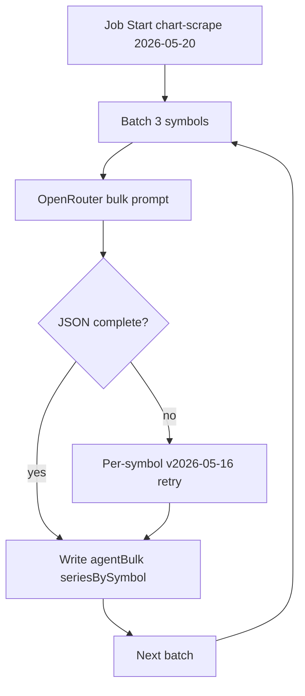

# Prompt engineering study guide — InvestAI

This document is the **canonical reference** for how LLM prompts are versioned, evaluated, and improved in this repo. Use it for demos, coursework, and iteration.

## Why versioning matters

Before May 2026, prompt text lived inline in agent files and `promptVersion` on prompt-eval runs was only a **label** — changing code changed behavior for all historical runs retroactively.

We now use **`@investai/prompts`**: a small registry where each surface has dated templates (`2026-05-16`, `2026-05-19`, …). Runs store **`promptSuite`** (resolved versions) on jobs and experiments.

## Architecture



## Prompt surfaces

| Prompt ID | File templates | Used by | Latest version |
|-----------|----------------|---------|----------------|
| `quote-scrape` | `packages/prompts/src/templates/quote-scrape.ts` | Prompt eval (3 tiers), legacy full agent jobs | `2026-05-19` |
| `chart-scrape` | `packages/prompts/src/templates/chart-scrape.ts` | Agent **Start** (home tab, charts-only) | `2026-05-19` |
| `news-scrape` | `packages/prompts/src/templates/news-scrape.ts` | Full agent jobs (news step) | `2026-05-16` |
| `ai-insights` | `packages/prompts/src/templates/ai-insights.ts` | `/api/ai/insights` | `2026-05-16` |
| `ai-prediction` | `packages/prompts/src/templates/ai-prediction.ts` | `/api/ai/stocks/:symbol/prediction` | `2026-05-16` |

**API catalog:** `GET /api/agent-scrape/prompts` → `{ latest, catalog[] }`.

## Version changelog (shipped)

### Quote scrape `2026-05-16` (baseline)

- JSON quotes + optional `reasoning`.
- User prompt accepts **goldenHint** (Yahoo EOD) and **ragContext** blocks.

### Quote scrape `2026-05-19` (RAG + golden)

- Root JSON includes `promptVersion: "2026-05-19"`.
- System text: golden EOD within 0.5%, RAG for names/sectors only.
- Selected when eval UI sends `v-2026-05-19` or `2026-05-19`.

### Chart scrape `2026-05-16` (baseline)

- 30 trading-day OHLC as compact `bars` arrays.
- Calendar from `lastTradingDayKeys(30)` in user prompt.

### Chart scrape `2026-05-19` (RAG)

- Same schema; optional per-symbol RAG block (catalog + news chunks).
- Production jobs: `AGENT_SCRAPE_RAG=true` (default) hydrates context before each symbol.

### Chart scrape `2026-05-20` (proposed — bulk batch)

- **Status:** design doc only — not in `@investai/prompts` yet. See [case study below](#case-study-chart-scrape--per-symbol-vs-bulk-batching).
- Goal: fewer OpenRouter calls and less repeated prompt text by sending **3–5 symbols** per request with a **shared 30-day calendar**.
- Trade-off: higher `max_tokens` per call and stricter JSON parsing; fallback to per-symbol v1 on truncation.

## Case study: chart scrape — per-symbol vs bulk batching

This section is the main **prompt versioning example** for InvestAI: same business output (30 trading-day OHLC per ticker), different **prompt shape**, **API call pattern**, and **reliability/cost** trade-offs. Use it when explaining why we ship multiple dated versions instead of “one best prompt.”

### What the product needs

For each symbol in the agent catalog (default **20**, from `AGENT_SCRAPE_SYMBOL_LIMIT`):

- **30 US equity session dates** (`AGENT_CHART_TRADING_DAYS` in `packages/shared/src/tradingDays.ts`).
- **OHLC** per date (volume optional).
- Stored in **`agentBulkCache`** (Firestore + server RAM), then shown on the dashboard in Agent mode.

No Live/Mock Yahoo prices are required for generation — only the LLM chart prompt (+ optional RAG for company context).

### How v1/v2 work today (one symbol per API call)



| Layer | Responsibility |
|--------|----------------|
| **Job** | `splitSymbolBatches(symbols, chartBatchSize)` → one step per batch in the queue UI |
| **Agent** | `scrapeChartSymbol` → one `callAiWithUsageFallback` per symbol |
| **Prompt** | `packages/prompts/src/templates/chart-scrape.ts` — dates listed in **every** user message |
| **Parser** | `parseChartPayload` — expects single-symbol `bars` (can read `series[]` but caller only requests one symbol) |
| **Cache** | `chartBatchCacheKey(batch)` — with batch size 1, cache key is per symbol |

**Config (repo root `.env`):**

| Variable | Default | Effect |
|----------|---------|--------|
| `AGENT_SCRAPE_CHART_BATCH_SIZE` | `1` | Symbols grouped per job step; with `1` = one LLM call per symbol |
| `AGENT_SCRAPE_SYMBOL_LIMIT` | `20` | How many symbols get chart steps |
| (code) `CHART_MAX_TOKENS` | `2048` | Hard cap in `chartScrapeAgent.ts` on completion length |

**Why batch size stayed at 1:** early tests with multiple symbols per response produced **truncated JSON** at 2048 tokens — the model ran out of output budget before finishing all bars. Reliability beat token savings.

### Token and cost intuition (20 symbols)

Rough planning numbers (actual usage varies by model):

| Component | Per-symbol (×20 calls) | Notes |
|-----------|------------------------|--------|
| System prompt | ×20 | Repeated every call |
| 30-date calendar in user prompt | ×20 | ~300–500 prompt tokens each time |
| Completion (30 compact bars) | ×20 | ~600–900 tokens each; fits in 2048 |
| **OpenRouter HTTP calls** | **20** | Latency + per-request overhead |

Estimate helper in `agentScrapeTokens.ts` assumes ~**450 prompt + ~750 completion tokens per symbol** → on the order of **~24k total tokens** for 20 symbols, dominated by **repeated instructions**, not OHLC digits.

**What you do *not* save by batching:** the number of OHLC numbers the model must emit (20 × 30 bars is fixed). **What you can save:** repeated system/calendar text and HTTP round-trips.

### Version comparison (design matrix)

| Version | Calls for 20 symbols | Calendar in prompt | Output schema | max_tokens | Primary risk |
|---------|----------------------|--------------------|---------------|------------|--------------|
| **2026-05-16** | 20 | Per call | `{symbol, bars[]}` | 2048 | Cost/latency |
| **2026-05-19** | 20 | Per call + RAG | Same + grounding | 2048 | Same + longer user prompt |
| **2026-05-20** (proposed) | 4–7 (batches of 3–5) | **Once per batch** | `{dates[], series[{s,b[]}]}` | 4096–8192 | Truncation / parse errors |
| **Hypothetical all-in-one** | 1 | Once | All 20 symbols | ~8k–12k+ | Severe truncation; poor eval signal |

### Trade-offs (how to choose a version)

Use this table when deciding whether to bump `PROMPT_LATEST['chart-scrape']` or keep an older version for comparison.

| Criterion | Per-symbol (v16/v19) | Small bulk batch (v20 proposal) | All symbols one call |
|-----------|------------------------|----------------------------------|----------------------|
| **Reliability** | High — fits 2048 | Medium — needs higher cap + retry | Low — often incomplete JSON |
| **Prompt tokens** | High duplication | Lower | Lowest |
| **Completion tokens** | Similar total OHLC | Similar total OHLC | Similar (if it finishes) |
| **Wall-clock time** | 20 sequential calls | 4–7 calls | 1 call |
| **Debugging** | Easy — one symbol per failure | Harder — partial batch failure | Hardest |
| **Chart eval interpretability** | Clear per-symbol steps | Per-batch step | Single blur |
| **Versioning story** | Baseline | **Efficiency iteration** | Usually rejected |

**Rule of thumb:** optimize **batch size × max_tokens** until parse success rate is acceptable on your tier (e.g. DeepSeek primary), then compare **actual `usage`** from `AgentScrapeJob.usage`, not estimates alone.

### Proposed `2026-05-20` — bulk prompt sketch

**Intent:** treat “batching” as a **new prompt version**, not a silent code change — so jobs record `promptSuite.chartScrape: "2026-05-20"` and chart eval can compare runs.

**System (concept):**

```text
Return ONLY minified JSON:
{"dates":["YYYY-MM-DD",...],"series":[{"s":"SYM","b":[[o,h,l,c],...]},...]}
Exactly 30 dates (shared). Each symbol must have 30 bars aligned to dates (oldest→newest). OHLC numbers only in b rows.
```

**User (concept):**

```text
Symbols: AAPL, MSFT, GOOGL
Dates (oldest→newest): 2026-03-10, 2026-03-11, ...
[optional one RAG block for the batch]
```

**Implementation checklist (when shipping):**

1. Add `chart-scrape` template in `packages/prompts/src/templates/chart-scrape.ts` (or `chart-scrape-bulk.ts`).
2. `scrapeChartsBulk` in `chartScrapeAgent.ts` — one OR call per batch; `scrapeChartSymbol` remains for fallback.
3. Raise `CHART_MAX_TOKENS` (or `AGENT_CHART_MAX_TOKENS` env) for bulk only.
4. Parser: `parseChartBulkPayload(symbols, dates)` — map short keys `s`/`b` back to `TimeSeriesData[]`.
5. On failure: retry batch as per-symbol **2026-05-16** (versioned fallback, not silent).
6. Set `AGENT_SCRAPE_CHART_BATCH_SIZE=3` in `.env.example` with comment.
7. Document actual token delta in `DEV_LOG_YYYY-MM-DD.md` after one real job.



### How to evaluate a new chart prompt version

Chart **prompt eval** (`quote-scrape`) does not measure chart bulk prompts — use this checklist instead:

1. **Estimate eval** — compare predicted vs actual tokens on a dry run (`GET /api/agent-scrape/estimate?chartsOnly=1`).
2. **Agent job** — run **Start** with `promptSuite` logged; note `usage.chartTokensUsed` and duration.
3. **Chart eval** — compare LLM vs Yahoo `dailyVsLive` and quote alignment (eval does not change prompts; it scores outcomes).
4. **Parse metrics** — log rate of fallback-to-per-symbol (add when implementing v20).
5. **A/B** — keep `PROMPT_LATEST` on v19 while testing v20 via env override or explicit version on job until stable.

Do **not** judge v20 only on prompt-token estimates; completion length and truncation dominate.

### Takeaways for coursework / demos

1. **Prompt versioning** here is not marketing text — it is **which JSON contract and call granularity** you use, stored on the job.
2. **More symbols per call** is not automatically cheaper: shared input helps; output size and failure modes dominate.
3. **2048 completion cap** is an architectural constraint as important as the prompt wording.
4. **Fallback to an older version** (per-symbol v16) is a valid pattern: new version for happy path, old version for reliability.
5. **RAG (v19)** adds grounding tokens; **bulk (v20)** targets structural duplication — orthogonal improvements.

## RAG (retrieval-augmented generation)

**Index:** `apps/backend/src/modules/agent-scrape/services/ragService.ts`

- Chunks: mock **stock catalog** (sector, cap, P/E) + first 12 **mock news** articles.
- Stored: memory → Firestore `ragChunks` (7-day TTL).
- Retrieval: filter by symbol, up to 2 chunks each.
- Format: `formatRagContextBlock()` in `@investai/prompts` (shared prefix text).

| Flow | RAG enabled? |
|------|----------------|
| Prompt eval (toggle) | Yes — `ragEnabled` on POST body |
| Agent chart job | Yes — `AGENT_SCRAPE_RAG` (default on) |
| Agent quote batches (legacy full job) | No golden/RAG in v1 path unless extended |
| Chart / estimate eval | **No** — metrics only, no LLM |

**Important:** RAG grounds **company context**, not prices. Prices for eval come from **Yahoo golden** or client `localStorage` ground truth.

## Eval systems (three dashboards)

### 1. Prompt eval — *prompt quality vs Yahoo*

- **UI:** Prompt eval view · **API:** `POST /api/agent-scrape/eval/prompt`
- Runs **three tiers** (cheap / mid / strong OpenRouter models).
- Compares agent quote + 30-day synthetic EOD vs Yahoo bars.
- Stores `promptVersion` (label) + `promptSuite.quoteScrape` (resolved).
- Optional RAG + improvement delta vs previous experiment.

### 2. Chart eval — *quote vs chart alignment*

- **No prompt changes** — records how well LLM 30-day bars match quote-implied EOD and Yahoo.
- Built in `chartEvalService.ts` when agent job completes.

### 3. Estimate eval — *cost estimate accuracy*

- Compares pre-scrape token estimate vs actual usage.
- **No prompts** — `estimateEvalService.ts` + shared `buildEstimateEvalFromJob`.

### 4. Static golden eval (regression)

- `POST /api/agent-scrape/eval` — JSON fixtures in `golden/*.json`.
- Shape/price band checks; separate from Yahoo prompt eval.

## Iteration workflow (recommended)

1. **Copy** a template in `packages/prompts/src/templates/` → new date version.
2. Register in `registry.ts` → bump `PROMPT_LATEST` for that id (or leave latest on previous version while A/B testing).
3. **Quote prompts:** run **prompt eval** with `promptVersion: "v-YYYY-MM-DD"` and RAG on; compare timeline (avg quote deviation).
4. **Chart prompts:** follow the [chart scrape case study](#how-to-evaluate-a-new-chart-prompt-version) — jobs + chart eval + token usage, not prompt eval alone.
5. When satisfied, latest pointer picks it up for **new** agent jobs automatically.
6. Document changes in `docs/DEV_LOG_YYYY-MM-DD.md`.

## What chart eval does *not* do

Chart eval does **not** select or version prompts. It only measures outcomes after a scrape. To improve charts, version **`chart-scrape`** and re-run Agent **Start**.

## Environment

| Variable | Default | Purpose |
|----------|---------|---------|
| `AGENT_SCRAPE_RAG` | `true` | Per-symbol RAG on chart scrape jobs |
| `AGENT_SCRAPE_CHART_BATCH_SIZE` | `1` | Symbols per chart LLM request (see case study) |
| `AGENT_SCRAPE_SYMBOL_LIMIT` | `20` | Symbols in one agent chart job |
| `OPENROUTER_API_KEY` | — | All LLM calls |
| `MARKET_CACHE_TTL_HOURS` | `12` | Aligns with stale chart/quote windows |

## Further reading

- [PROJECT_SCOPE.md](./PROJECT_SCOPE.md) — product capabilities
- [AGENT_EVALS.md](./AGENT_EVALS.md) — eval storage & APIs
- [AGENT_SCRAPE.md](./AGENT_SCRAPE.md) — job orchestration
- [DEV_LOG_2026-05-19.md](./DEV_LOG_2026-05-19.md) — registry + RAG on charts
